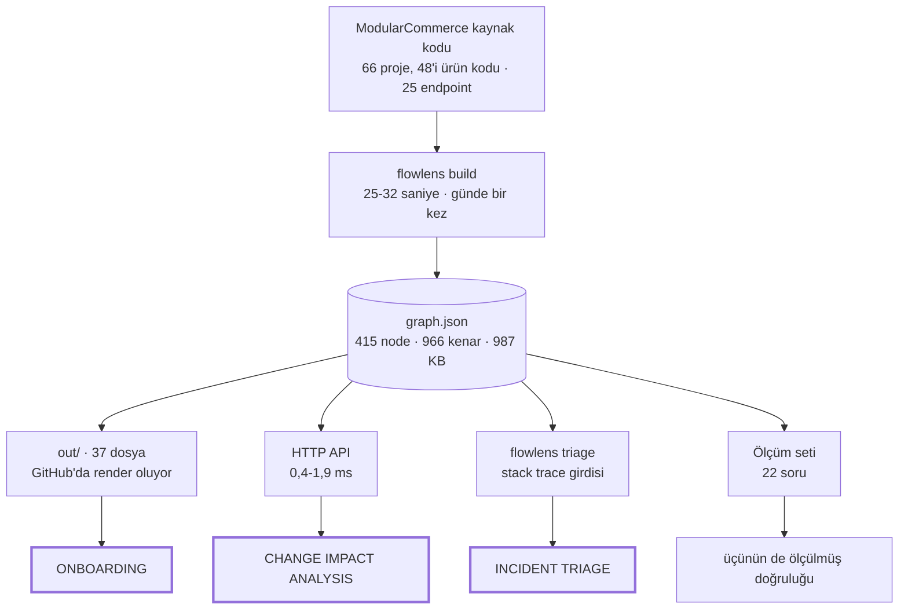
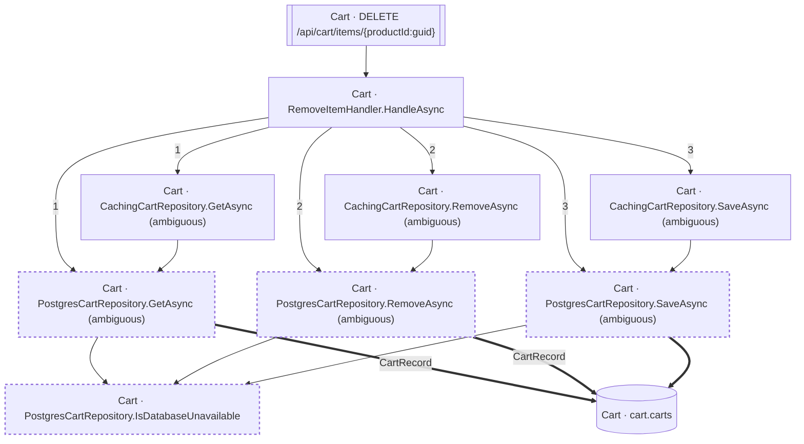
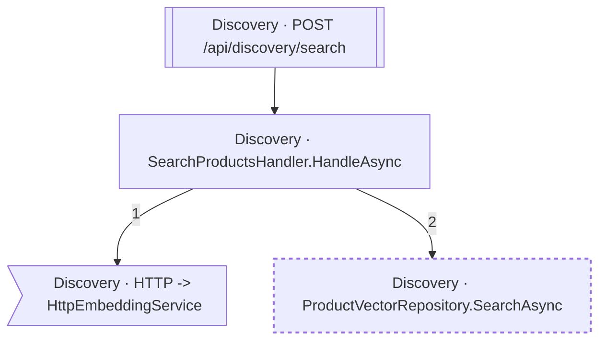
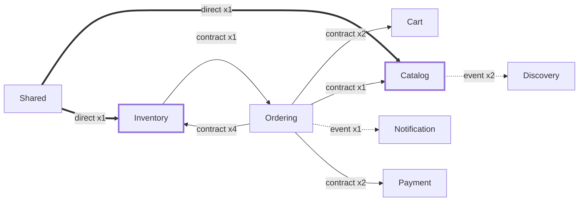

# Bir kod tabanının haritası yoksa, üç kişi aynı anda kaybolur

## 🌅 Bir sabah, üç kişi

Saat 09:40. Analist bir developer'ın masasına gidiyor: "İade akışını anlatır mısın, yeni bir ödeme sağlayıcısı ekleyeceğiz." Developer ekranını çeviriyor, birlikte kod okumaya başlıyorlar. Yirmi dakika sonra ellerinde bir cevap var ama iki kişinin sabahı gitti ve cevabın eksiksiz olduğunu kimse garanti edemiyor.

Saat 11:15. Ekibe iki gün önce katılan geliştirici, siparişin nereden nereye gittiğini hâlâ çıkaramadı. Wiki'de bir sayfa var; en son on bir ay önce güncellenmiş. Sayfadaki üç servis adından ikisi artık kodda yok.

Saat 14:40. Production'da 500'ler başlıyor. Nöbetçinin elinde bir stack trace var. İlk sorusu "bu hata neden oldu" değil, ondan önceki soru: hangi ekibi arayacağım, bu kod hangi tablolara dokunuyor, en son kim değiştirdi.

Üç sahne, üç farklı kişi, tek bir eksik. Kimse yalan söylemiyor, kimse tembellik etmiyor. Kod tabanının makine tarafından okunabilir bir haritası yok ve bu haritanın yokluğu her seferinde bir insanın zamanından karşılanıyor.

Bu haritayı çıkaran bir araç yazdım. Anlatacağım şey aracın ne bulduğu değil. Çünkü **bir aracı güvenilir yapan şey ne bulduğu değil, bulamadığını söyleyebilmesidir.**

> **Developer notu.** Teknik ayrıntılar bu yazıda böyle blockquote içinde duruyor. Analist ya da takım lideriyseniz hepsini atlayabilirsiniz, ana anlatı bozulmaz.

## 🎯 Üç problem, adlarıyla

Yukarıdaki üç sahnenin üçü de kişisel bir beceriksizlik değil. Üçünün de literatürde adı var, ve üçü de aynı eksiklikten besleniyor.

| Problem | Bugün nasıl çözülüyor | Maliyet |
|---|---|---|
| **Onboarding** | Birine sormak, ya da günlerce kod okumak. Doküman varsa eskimiş | Yeni kişinin ilk haftası, ve sorduğu kişinin kesintileri |
| **Change impact analysis** | Analist developer'a gidiyor: "bu akışı anlat" | Bir developer'ın 20-30 dakikası, kişiye göre değişen ve eksik kalabilen cevap |
| **Incident triage** | Loglara bakmak, local'de debug etmek | Nöbetçinin ilk yarım saati, çoğu "nereye bakacağım" sorusuna gidiyor |

Change impact analysis akademik bir terim: bir değişikliğin sistemde nereye yayıldığını çıkarmak. Program slicing onun bir alt kümesi. Incident triage ise operasyon tarafının kendi adlandırması. Yani bunlar "keşke daha düzenli olsaydık" tarzı problemler değil; üzerine makale yazılmış, araçları olan problemler.

Ortak zemin şu: üçü de **aynı soruyu** farklı yönlerden soruyor. Onboarding ileri yönde sorar (bu endpoint nereye gidiyor), change impact analysis geri yönde sorar (bu tabloya kim dokunuyor), incident triage bir noktadan başlayıp iki yöne birden sorar. Elinizde yön değiştirebilen tek bir harita varsa üçü de aynı veriden cevaplanıyor.

Ben o haritayı bir .NET modular monolith üzerinde çıkardım: 66 projelik bir solution, 48'i ürün kodu ve 18'i test. İçinde 25 endpoint ve 8 ayrı veritabanı context'i var.

## 🗺️ Çözümün şekli: adım adım ne inşa edildi

Harita tek hamlede çıkmıyor. Dört katman var, her biri farklı bir soru soruyor, ve sonuncusu hepsini tek dosyada birleştiriyor. Zeminde tek bir olgu duruyor: C# derleyicisinin kendisi bir kütüphane, yani kodu çalıştırmadan okuyup anlamlandırabiliyorsunuz.

**1. Giriş noktaları: istek nereden giriyor?**

İlk iş her HTTP giriş noktasını bulmak. Bu projede 25 tane var. Klasik bir Controller projesinde bunlar sınıf içindeki metotlar olurdu ve bulmak kolay olurdu. Burada hepsi Minimal API lambda'sı, yani bir metot bildirimi bile değiller: metot bildirimlerini tarayan klasik yaklaşım 25 endpoint'in **sıfırını** görüyor. Aranması gereken şey metot değil, `MapPost` gibi bir çağrının kendisi ve ona verilen lambda.

**2. Çağrı zinciri: o istek nereye gidiyor?**

Endpoint bulunduktan sonra gövdesindeki her çağrı takip ediliyor, sonra o çağrının gövdesindeki her çağrı, özyinelemeli olarak. Zincirin tepesinde endpoint, altında handler, onun altında çağırdığı metotlar ve repository'ler.

Zincir bir yerde çatallanıyor: çağrı bir arayüze yapılmışsa hangi implementasyonun koşacağı kaynakta yazmıyor. Verilen karar hepsini eklemek ve düğümü `ambiguous` işaretlemek. Var olan bir yolu kaçırmak, fazladan bir yol taşımaktan tehlikeli.

**3. Veri katmanı: hangi tabloya, hangi kolona?**

Buraya kadar her şey koddu. Tablo ve kolon adları kodda yazmıyor, veritabanı eşleme katmanının kendi modelinde duruyor. Üçüncü adım o modeli okuyup entity'yi tabloya, property'yi kolona bağlamak. İsim tahmini yok, SQL cümlesi ayrıştırma yok: 16 tablo, 97 kolon.

**4. Modül köprüleri: zincir nerede kopuyor?**

Modüller birbirini doğrudan çağırmıyor, event yayınlıyor. Senkron zincir orada bitiyor ve harita yarım kalıyor. Dördüncü adım o boşluğu kapatmak: hangi event nerede doğuyor, hangi consumer dinliyor.

**Ve hepsi tek dosyada.**

Dört adımın çıktısı tek bir yerde birleşiyor: `graph.json`. 415 node, 966 kenar, diskte 987 KB. Node dediğim şey bir endpoint, handler, metot, repository, entity, tablo, kolon ya da event. Kenar ise aralarındaki ilişki: çağırıyor, okuyor, yazıyor, eşleniyor, yayınlıyor, tüketiyor.

Tek bir akışta zincirin hâli:

```text
endpoint:DELETE /api/cart/items/{productId:guid}     giriş noktası
  └─ RemoveItemHandler.HandleAsync                   handler
      └─ ICartRepository.SaveAsync                   arayüz (ambiguous)
          └─ PostgresCartRepository.SaveAsync        implementasyon
              └─ cart.carts                          tablo
                  └─ CustomerId, Items, UpdatedAtUtc kolonlar
```



Dört adımın tamamı **25-32 saniye** sürüyor, çünkü solution'daki 66 projenin tamamını derlemeyi gerektiriyor. Analiz sonra bunların **48'i** üzerinde koşuyor: test projeleri bilerek dışarıda. Sebep gürültü değil, **sahte kenar**: testler atılabilir consumer'lar tanımlıyor ve generic publish çağrıları yapıyor, ikisi de haritaya gerçekte var olmayan bir yol eklerdi.

Bir HTTP isteğinin arkasında bu iş asla çalışmaz, çalışmasına gerek de yok: pahalı hesap günde bir kez, ucuz sorgu binlerce kez. Ölçülen sorgu süresi **0,4-1,9 ms**.

Ama asıl kazanç performans değil. `graph.json` bir metin dosyası olduğu için repoya commit'leniyor, `git diff` ile karşılaştırılıyor ve elle okunabiliyor. Bu sonuncusu projenin en somut faydasını üretti: testler yeşilken graph'ın üç yerde sessizce yanlış cevap verdiğini fark eden şey, dosyayı satır satır okumaktı.

Üstündeki dört tüketici de aynı dosyadan besleniyor, dolayısıyla dördü birden yanılabilir ama biri diğerinden farklı bir cevap veremez. Dosya hiç yoksa veri uçları açık bir hata dönüyor: gövdesinde hangi yollara bakıldığı ve dosyayı üretecek komut yazılı. Sessiz boş liste yok.

## 🧱 Üç proje ve bağımlılık yönü

> **Developer notu.** Araç üç projeden oluşuyor: `Core` (bütün mantık), `Cli` (komut satırı) ve `Api` (HTTP yüzeyi).
>
> Bağımlılık tek yönlü. `Core` hiçbirine referans vermiyor; `Cli` ve `Api` yalnız `Core`'a bakıyor ve birbirlerini tanımıyorlar. CLI, API'nin varlığından habersiz.
>
> Bunun "temiz mimari" olduğu için değil, başka bir sebeple böyle olması gerekiyordu. Projenin opsiyonel son adımı bir doğal dil arayüzü ve o da dördüncü bir proje olacak. Kural şu: `Core` ona da referans vermeyecek. Sonuç, o katmanı **çıkardığınızda ürünün çalışmaya devam etmesi**.
>
> Bu bir zarafet tercihi değil, kurumsal bir şart. Büyük şirketler kaynak kodunu, özellikle çekirdek iş mantığını, harici bir LLM sağlayıcısına göndermek istemiyor. LLM'e bağımlı bir araç o kurumlarda değerlendirmeye bile alınmıyor. LLM'siz çalışan bir araç doğrudan kurulabiliyor.
>
> Aynı ayrımın ikinci bir faydası var: her tüketici aynı çekirdeği çağırdığı için, ölçüm setini yalnız `Core`'a koşturmak beş tüketiciyi birden ölçüyor. Komut satırı, HTTP API, dokümantasyon üreteci, triage ve ölçümün kendisi aynı projeksiyon fonksiyonundan geçiyor. Biri diğerinden farklı bir cevap veremiyor, çünkü verecek ayrı bir yolu yok.
>
> Tek yönlü bağımlılık burada temizlik değil, **çıkarılabilirlik** ve **ölçülebilirlik** üretiyor.

## 📐 Yedi adım, yedi çıktı

Yukarıdaki dört katman **ne** inşa edildiğini anlatıyor. Bu tablo **hangi sırayla ve neden**. Adımların adları önemli değil, ürettikleri önemli, ve üçüncü sütun en az ikincisi kadar: o adım olmasaydı ne olurdu.

| Ne üretildi | Hangi problemi çözdü | Olmasaydı |
|---|---|---|
| Solution 66/66 güvenilir yükleniyor | Zemin | Sessizce atlanan bir proje, "bu metot çağrılmıyor" ile "hiç bakmadık"ı ayırt edilemez yapardı |
| 25 endpoint ve çağrı zincirleri | Onboarding'in yarısı | Endpoint'lerin tamamı lambda olarak tanımlı; klasik metot taraması 25'in sıfırını görüyor |
| `graph.json`: 16 tablo, 97 kolon | Change impact analysis'in çekirdeği | Her soru için 25-32 saniyelik derleme; hiçbir tüketici mümkün olmazdı |
| 5 uçlu HTTP API, ~2 ms | **Change impact analysis çözüldü** | Analistin cevap alması için komut satırı çalıştırması gerekirdi |
| `out/` altında 37 dosya | **Onboarding çözüldü** | Yeni gelen hâlâ araç kurup komut yazmak zorunda kalırdı |
| `flowlens triage` | **Incident triage çözüldü** | Geriye doğru sorgu zaten vardı; eksik olan sormanın yoluydu |
| 22 soruluk ölçüm seti | Üçünün de ölçülmüş doğruluğu | 110 test yeşilken graph üç yerde sessizce yanlış cevap veriyordu; hiçbir sayı ölçülmemiş olurdu |

Son satır bu yazının tezine en yakın olanı. O adım tek satır ürün kodu üretmedi, **ölçüm** üretti. Ve ölçtüğü şeylerin bir kısmı aracın kendi körlükleriydi.

> **Developer notu.** Tablodaki sıra pazarlık konusu değildi: bir adımın kabul kriterleri karşılanmadan sonraki adıma geçilmedi. Sebep ikinci satırda görünüyor. Endpoint keşfi yanlış olsaydı çağrı zinciri de yanlış yerden başlardı, veri katmanı da o yanlış zincire bağlanırdı, ve hata ancak en sonda, en pahalı yerde ortaya çıkardı.

Doğal dil arayüzünün neden en sona bırakıldığını yukarıda yazdım. Buraya bir cümle daha ekleyeyim: doğruluğa hiçbir şey katmıyor. Analistin endpoint adını bilmek zorunda olmamasını sağlıyor, o kadar. Konfor katmanı, doğruluk katmanı değil.

## 📄 Üretilen dokümantasyon: yazının merkezi

Buraya kadar anlatılan her şey altyapı. Ekibin çoğunluğunun gördüğü tek şey ise şu klasör: `out/`. 37 dosya, tamamı `graph.json`'dan üretiliyor, tamamı GitHub'da hiçbir şey kurmadan açılıyor.

### Giriş sayfası

`out/README.md` on modülü ve 25 akışı listeliyor, her satır bir dosyaya bağlantı. En üstte üretimin kendi notu duruyor: elle düzenlenmez, ve her üretim aynı girdiden aynı baytları verir.

[GÖRSEL 1]

Hemen altında bu yazının tezini altı kelimede söyleyen bir uyarı var:

> **Kapsam uyarısı.** FlowLens'in gördüğü, EF Core'un gördüğüdür. Ham SQL ile
> erişilen tablolar ve ilişkisel olmayan depolar burada **yok** — ama nerede
> bakılamadığı ilgili sayfada `file:line` ile yazılı.

Ve sayfanın sonunda "Veri katmanına dokunmayan (2)" başlıklı bir bölüm duruyor. İki endpoint hiçbir tabloya ulaşmıyor, ve sayfa bunu bir eksiklik gibi değil bir sonuç gibi yayınlıyor:

> Bunlar eksik değil — ölçüldü ve hiçbir tabloya ulaşmıyorlar.

[GÖRSEL 2]

### Tek soru, tek sayfa

Sayfayı tarif etmek yerine bir soru soralım:

> **Sepet silme akışı neye dokunuyor?**

Cevabı `out/flows/delete-api-cart-items-productid-guid.md` veriyor.

**Önce diyagrama bakıyorsunuz.** Endpoint'ten `RemoveItemHandler`'a, oradan iki repository'ye, sondaki silindir kutuya: `cart.carts`. Kabaca cevap on saniyede elinizde.



**Sonra "hangi kolonlar" diye soruyorsunuz.** Veri katmanı tablosu tek satır:

| Tablo | Erişim | Kolonlar | Tanım |
|---|---|---|---|
| `cart.carts` | WR | `CustomerId`, `Items`, `UpdatedAtUtc` | `.../Configurations/CartConfiguration.cs:10` |

`WR` hem yazıldığını hem okunduğunu söylüyor, ve satırın sonunda eşlemenin tanımlandığı `dosya:satır` var. Doğrulamak isterseniz gideceğiniz yer belli.

**Sonra "bu her zaman mı oluyor" diye soruyorsunuz.** Numaralı adım listesi:

```markdown
1. `RemoveItemHandler.cs:14` → `CachingCartRepository.GetAsync`, `PostgresCartRepository.GetAsync`
2. `RemoveItemHandler.cs:33` *(koşullu)* → `CachingCartRepository.RemoveAsync`, ...
3. `RemoveItemHandler.cs:34` *(koşullu)* → `CachingCartRepository.SaveAsync`, ...
```

İkinci ve üçüncü adım `koşullu` işaretli ve kaynakta bir ternary'nin iki dalı: sepet boşaldıysa siliniyor, boşalmadıysa kaydediliyor. İkisi birden koşmuyor. Sayfa bunu kendisi söylüyor:

> **Numaralar kaynak kodda yazılma sırasıdır**, çalışma sırası değil —
> koşullu dallar, döngüler ve erken `return`'ler ikisini ayırır.
> **`koşullu` işaretli adımlar hiç koşmayabilir**, ve bir `if`/ternary'nin iki
> dalındaki adımlar birbirini dışlar — ikisi birden koşmaz.
> Aynı numarayı taşıyan kutular **tek bir çağrıdan** gelir.

Son cümle listedeki tekrarı açıklıyor: her adım iki repository'ye birden gidiyor çünkü çağrı bir arayüze yapılmış ve arayüzün iki implementasyonu var. İki kutu, tek çağrı.

Yani bu bir sequence diagram değil ve öyle olmadığını okuyucuya söylüyor.

[GÖRSEL 3]

**En son "bu liste tam mı" diye soruyorsunuz.** Son bölüm üç sınır kodu taşıyor: `ambiguous-implementation` (iki repository implementasyonu da graph'ta, hangisinin koştuğu kaydedilmiyor), `second-class-evidence` (bir yazma iddiası dolaylı kanıta dayanıyor), `unmapped-column` (jsonb belgesinin içindeki üç alanın kolonu yok). Üçünün de altında `dosya:satır` listesi var.

[GÖRSEL 4]

Ve sayfanın kendini ölçen satırı:

> Gösterilen **10** node; ham yürüyüş **38** node'a ulaşıyor.

Neyin gizlendiğini sayarak söylüyor: 18 ara çağrı, 7 utility, 3 arayüz bildirimi. Ölçekte aynı oran, sistemin en büyük akışı olan checkout'ta **24 / 192**. Diyagram grafiğin sekizde birini gösteriyor ve veri katmanında 12 tablo ile 62 kolon listeliyor.

[GÖRSEL 5]

Dört sorunun dördü tek sayfadan cevaplandı, ve bu sayfaların hiçbiri elle yazılmadı.

### İki karşıt sayfa

`get-api-catalog-products.md` bir tabloya ulaşıyor ama kolon listesi boş. Modül sayfalarındaki kural sebebini açıklıyor:

> `W` = yazılıyor · `R` = okunuyor · kolonlar yalnız bir yazma onları adlandırdığında listelenir.

Bu bir okuma, ve okuma kolon yazmaz. Boş liste burada doğru cevap.

[GÖRSEL 6]

`post-api-discovery-search.md` ise daha ilginç: sayfada **"Veri katmanı" bölümü hiç yok**. Boş değil, yok. O modül ham SQL kullanıyor ve araç oraya bakamıyor. Ama sayfa susmuyor, kör olduğu üç satırı adıyla veriyor: `ProductVectorRepository.cs:26`, `:40` ve `:60`.



### Modül bağımlılık grafiği

`out/modules/dependencies.md` tek ekranda sekiz modül ve dokuz kenar gösteriyor. Üç kenar stili: düz ok sözleşme çağrısı (meşru), kesikli ok event (meşru), kalın ok sözleşme katmanı dışından doğrudan referans, yani ihlal adayı.


| Kategori | Kural | Ok |
|---|---|---|
| **Sözleşme çağrısı** — meşru | hedef katman `Contracts`, kenar `CALLS` | düz `-->` |
| **Event** — meşru, en gevşek bağ | `PUBLISHES` / `CONSUMES` | kesikli `-.->` |
| **Doğrudan referans** — ⚠ ihlal adayı | hedef katman `Application` / `Infrastructure` / `Domain` | kalın `==>` |

İki ihlal adayı çıkmış, ikisi de ters yönde ve ikisi de veri tohumlama kodu. Sayfanın tutumu net:

> `Contracts` dışından doğrudan referanslar. **Bu bir hüküm değil, bir işaret** —
> kasıtlı bir tercih olabilir; kararı okuyan verir.

[GÖRSEL 7]

Ve üreteçte editoryal yargı olduğunu gösteren paragraf:

> `Shared`'a giden **204** kenar diyagrama çizilmedi: 8 modülün tamamı `Shared.Kernel`'e bağlı ve bu tasarım gereği. Hepsini çizmek `Shared`'ı her şeye bağlı bir merkez yapar ve hiçbir şey söylemez.

204 kenar bilerek çizilmedi, 2 kenar ters yönde çizilip işaretlendi, gerekçe sayfanın kendisinde yazılı.

Her modülün ayrıca kendi sayfası var: endpoint'ler, tablolar, event'ler, bağımlılıklar ve sınırlar. Ordering sayfasındaki event tablosu layout'un tek başına ürettiği bir bulguyu görünür kılıyor: `OrderCancelled` yayınlanıyor, tüketici sütunu **yok** diyor.

[GÖRSEL 8]

## 🚶 Üç senaryo, adım adım

### Onboarding

Yeni giren developer, ilk günü, hiçbir kurulum yok. GitHub'da `out/README.md` açılıyor, oradan `modules/dependencies.md`'ye geçiliyor ve mimarinin tamamı tek ekranda görülüyor. Sonra ilgileneceği modülün sayfası, sonra bir akış diyagramı.

**Yaklaşık 10 dakika**, kimseye tek soru sormadan. Ve kritik detay: her kutuda `dosya:satır` var, yani okumaktan koda geçiş tek tık.

### Change impact analysis

Analistin sorusu: "sepetin saklanma biçimini değiştireceğiz, nereler etkilenir?"

İki yol var. Tarayıcıda ilgili akış sayfasını açmak, ya da API'ye tek istek atmak:

```bash
curl "http://localhost:5000/backward?node=column:cart.carts.Items"
```

Cevap **2 milisaniyede** geliyor: o kolonu yazan bütün giriş noktaları, her biri `dosya:satır` ile.

Ve asıl kazanç burada ölçüldü. `cart.carts` tablosuna dokunan beş giriş noktasından dördü Cart modülünde, beşincisi **`POST /api/ordering/checkout`**. Yani başka bir modül. Analist bunu developer'a sormadan görüyor, ve dürüst olmak gerekirse developer'ın da aklına gelmeyebilirdi.

**30 dakikalık bir toplantı, 2 dakikalık bir sorgu oluyor.**

[GÖRSEL 9]

Buradaki değişimi doğru okumak lazım. Yazılımcının rolü ortadan kalkmıyor, **değişiyor**. Analist artık "hangi tablolar etkilenir" diye sormuyor, çünkü o mekanik bilgi araçta duruyor. Ama "bu iş kuralı neden böyle", "bu değişikliği yaparsak müşteri tarafında ne olur", "burada bir yarış durumu var mı" diye sormaya devam ediyor. Araç mekanik olanı devraldı, yargı gerektireni değil.

### Incident triage

Nöbetçi, 14:40, elinde bir exception. Log'dan kopyalayıp bir dosyaya yapıştırıyor ve komutu çalıştırıyor:

```bash
dotnet run --project src/FlowLens.Cli -c Release -- triage --stack-trace crash.txt
```

`crash.txt` özel bir format değil, yığın izinin ham metni; adı da önemli değil, `--stack-trace` neyi gösterirseniz onu okuyor. Dosya yerine boru da olur, `--stack-trace -` standart girdiden okur.

Komut üç şey **okuyor** ve hiçbirini değiştirmiyor: bu dosyayı, `graph.json`'ı, ve hedef reponun `git log` çıktısını. Solution yüklenmiyor, yani buradaki cevap 25-32 saniye değil saniyeler sürüyor.

Repo yolunu ayrıca sormuyor, çıkarıyor: yığın izi hata ayıklama sembollerinden gelen **mutlak** yollar taşıyor, graph'taki her düğüm aynı dosyanın **repo-göreli** yolunu taşıyor, ve kök ikisinin farkı. Elle `--repo` ile de verilebiliyor; verildiğinde asla sessizce başkasıyla değiştirilmiyor.

Rapor üç şeyi birden veriyor. **Giriş noktaları**: `POST /api/inventory/reservations` ve `POST /api/ordering/checkout`, yani iki farklı ekip. **Dokunulan tablolar**: `inventory.reservations` yazılıyor, `inventory.stock_items` hem okunuyor hem yazılıyor. **Son değişiklikler**: üç dosyanın her birinin son commit'leri, en yenisi `30109b3 rate limiting`.

Nöbetçinin ilk sorusu "kimi arayacağım" idi ve cevap raporun ortasında duruyor.

[GÖRSEL 10]

> **Denemek isterseniz.** Yukarıdaki rapor uydurma değil, repodaki gerçek bir yığın izinin çıktısı. Beş tane duruyor ve beşi de gerçek: dördü çalışan bir Postgres örneğine karşı yakalandı, biri altyapı gerektirmeden. Hiçbiri elle yazılmadı.
>
> ```bash
> dotnet run --project src/FlowLens.Cli -c Release -- triage --stack-trace tests/FlowLens.Tests/Fixtures/StackTraces/A-inventory-reserve.txt
> ```
>
> İçlerinden biri (`C-money-add.txt`) bilerek **başarısız** oluyor ve `exit 4` veriyor: aradığı çerçeve graph'ta yok. Aracın en önemli davranışını görmek isterseniz onu çalıştırın, çünkü *"çağrı yok"* demiyor, *"o çerçeveyi göremedim"* diyor.

## 🔌 Gerçek dünya girdisi: Kibana

Yukarıdaki `crash.txt` temiz bir dosya. Gerçekte iz Kibana'dan gelir ve orada metin nadiren temizdir. Varsayım yerine ölçtüm: aynı yığın izinin sekiz farklı biçimi araca verildi.

| Girdi | Sonuç |
|---|---|
| Gerçek satır sonlarıyla yapıştırılmış ham metin | Çalışıyor |
| Tek satır, `\n` kaçışlı, ya da JSON belgesine gömülü | Çalışmıyor: sıfır çerçeve, `exit 4` |
| Log öneki başlığa yapışık | Rapor tam, yalnız exception tipi boş |

Sebep basit: ayrıştırıcı satır tabanlı çalışıyor ve her çerçeve satırının belirli bir biçimde başlamasını bekliyor. Kibana'nın tek satırlık çıktısında gerçek satır sonu yok, dolayısıyla ayrıştırılacak çerçeve de yok.

İkinci satır tek komutla düzeliyor:

```bash
sed 's/\\n/\n/g' kibana.txt | flowlens triage --stack-trace -
jq -r '.message'  kibana.json | flowlens triage --stack-trace -
```

Yani "kopyala yapıştır çalışır" varsayımı yarı yarıya doğru çıktı: gerçek satır sonları hayatta kaldıysa çalışıyor, kalmadıysa bir satırlık ön işleme gerekiyor. Üçüncü satırın niye ilginç olduğuna bir sonraki bölümde geleceğim.

## 🔍 Sınırlar, dürüstçe

Bu bölüm yazının en önemli kısmı, çünkü tez tam olarak burada sınanıyor.

22 soruluk bir ölçüm seti yazdım. Beklenen cevaplar aracın çıktısına bakılmadan, kaynak kod okunarak çıkarıldı. Sonuç, hiçbir eksende yüzde yüz değil:

| Eksen | Recall |
|---|---:|
| Tablo, veritabanı katmanı içinden | %97,1 |
| Tablo, veritabanı katmanı dışından | %75,0 |
| Tablo erişimi (okuma/yazma ayrımı) | %83,8 |
| Kolon yazma, veritabanı katmanı içinden | %81,6 |
| **Kolon okuma** | **%0** |
| Giriş noktası | %76,5 |
| Event | %60 |
| İlişkisel olmayan depo (Redis) | **%0** |

Tek bir ortalama vermiyorum, çünkü ortalama aracın nerede kör olduğunu gizler. Bu sekiz sayının ortalaması makul bir rakam verirdi ve içindeki iki sıfırı görünmez yapardı.

[GÖRSEL 11]

Dört körlük, sebepleriyle:

**Ham SQL.** Elle yazılmış SQL ile erişilen tablolar görünmüyor. SQL cümlesi ayrıştırmak bilinçli olarak kapsam dışında bırakıldı. Etkilenen modülün tablo recall'ı sıfır.

**Redis ve ilişkisel olmayan depolar.** Ontolojide karşılıkları yok. Redis'e yazan bir akış hiçbir düğüm üretmiyor.

**Kolon okuması.** Kolon düğümleri yalnız bir **yazma** onları adlandırdığında doğuyor. "Bu kolonu kim okuyor" sorusunun graph'ta karşılığı yok, ve boş liste burada bir cevap değil.

**Reflection ve dynamic.** Hedef repo kullanmıyor, dolayısıyla popülasyon sıfır. Bu "çalışıyor" demek değil, **ölçülemedi** demek. İkisini karıştırmak, ölçülmemiş bir şeyi ölçülmüş göstermek olur.

Ve şimdi Kibana testinin üçüncü satırı. Log öneki başlığa yapıştığında araç exception tipini **boş bırakıyor**. Oysa ilk satırı alıp "exception tipi: `[2026-08-12 09:14:22 ERR]`" demek de mümkündü. Ayrıştırıcının kodundaki yorum neden yapmadığını yazıyor:

> Taking whatever came first would then report a timestamp as the exception type: not a crash, just a confidently wrong field, which is the failure shape this project keeps finding.

Çökme değil, **kendinden emin yanlış bir alan**. Araç kendi çıktısında da aynı kuralı uyguluyor: emin olmadığı alanı doldurmak yerine boş bırakıyor, gerisini eksiksiz veriyor.

[GÖRSEL 12]

Bir aracın en tehlikeli çıktısı boş kümedir. Doğru boş küme (bir okuma endpoint'inin sıfır kolon raporlaması) ile yanlış boş küme, çıktıda birbirinden ayırt edilemiyorsa, tüketici ikisini de tam güvenle okur. Bu araçta ayırt ediliyor: birincisi sessiz, ikincisi `dosya:satır` ile konuşuyor.

## 🧭 Kendi projenizde

> **Developer notu.** Aracın çalışması için gereken ön koşullar, abartmadan:
>
> - **EF Core.** Tablo ve kolon eşlemesi oradan okunuyor. Başka bir ORM ile çalışmaz.
> - **Minimal API ya da Controller.** Endpoint keşfi bu iki şekle bağlı.
> - **Tek solution.** Çoklu repo desteği bilinçli olarak kapsam dışı.
> - **Derlenmiş hedef.** Veritabanı modeli derlenmiş assembly'den okunuyor, kaynak koddan değil.
>
> Yazı boyunca `flowlens ...` yazdım; bu bir kısaltma. Araç bir global tool olarak paketlenmiş değil, repoda `dotnet run --project src/FlowLens.Cli -c Release -- <komut>` olarak koşuyor.
>
> **Nereden başlanır:** graph üretmekten değil, **saymaktan**. Solution'ı yükleyip "kaç proje, kaç metot" demekten. Bu bir ısınma egzersizi değil. Bu projede önceden çıkarılmış envanter 68 proje diyordu, doğrusu **66** çıktı. Araç ilk faydasını daha ortada bir graph yokken verdi.
>
> **Sonra sıra:** endpoint keşfi, çağrı zinciri, veritabanı modeli, `graph.json`, ve en son tüketiciler. Tüketicilerden hangisiyle başlayacağınız kitlenize bağlı: ekipte analist varsa API, sık yeni kişi giriyorsa dokümantasyon, sık incident varsa triage. Üçü de aynı dosyadan çıkıyor, sırası serbest.
>
> **Ve bir uyarı.** Ölçmeden "çalışıyor" demeyin. Bu projede 110 test yeşilken graph üç yerde sessizce yanlış cevap veriyordu. Testler kodun **çalıştığını** doğrular, cevabın **doğru** olduğunu değil. İkisi ayrı işler ve ikincisi için ayrı bir set gerekiyor.
>
> Bu setin nasıl yazıldığı da önemli: beklenen cevaplar aracın çıktısına bakılmadan, kaynak kod okunarak çıkarıldı, ve sorular runner yazılmadan önce commit'lendi. Aksi hâlde ölçüm aracı ölçtüğü şeyin kopyası olur. Ölçmenin kendisi de ölçülüyor: 22 sorunun 3'ünde beklenen değer yanlış çıktı, düzeltildi ve düzeltmeler ayrı commit'lerde kaynak kanıtıyla duruyor. Ölçüm setinin hata payı sıfır değil, **ölçülmüş**.

## 🏁 Kapanış

Üç problem, tek harita, ve haritayı güvenilir yapan şey kapsadığı alan değil, kapsamadığı alanı işaretlemesi.

Onboarding'de yanlış bir harita, hiç harita olmamasından kötüdür. Change impact analysis'te eksik bir kolon eksik bir migration demektir. Incident triage'da yanlış giriş noktası yanlış ekibi uyandırır.

Bu yüzden aracın en çok emek verdiğim kısmı bulduklarını göstermek değil, bulamadıklarını görünür kılmaktı.

Üretilen 37 dosya ve ölçüm raporu repoda duruyor:

- Araç: [LINK: FlowLens GitHub]
- Analiz edilen proje: [LINK: ModularCommerce GitHub]
