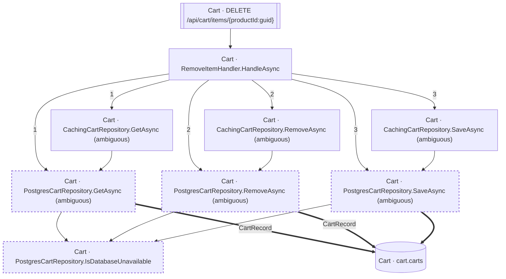

<!-- ÜRETİLMİŞ DOSYA — elle düzenlemeyin. `flowlens docs` ile yeniden üretilir. -->

# DELETE /api/cart/items/{productId:guid}

**Modül:** Cart · **Tanım:** `src/Modules/Cart/ModularCommerce.Cart.Api/Endpoints/CartEndpoints.cs:57`

> **Numaralar kaynak kodda yazılma sırasıdır**, çalışma sırası değil —
> koşullu dallar, döngüler ve erken `return`'ler ikisini ayırır.
> **`koşullu` işaretli adımlar hiç koşmayabilir**, ve bir `if`/ternary'nin iki
> dalındaki adımlar birbirini dışlar — ikisi birden koşmaz.
> Aynı numarayı taşıyan kutular **tek bir çağrıdan** gelir.

## Çağrı sırası

**RemoveItemHandler.HandleAsync** — `src/Modules/Cart/ModularCommerce.Cart.Application/Carts/RemoveItem/RemoveItemHandler.cs:9`

1. `RemoveItemHandler.cs:14` → `CachingCartRepository.GetAsync`, `PostgresCartRepository.GetAsync`
2. `RemoveItemHandler.cs:33` *(koşullu)* → `CachingCartRepository.RemoveAsync`, `PostgresCartRepository.RemoveAsync`
3. `RemoveItemHandler.cs:34` *(koşullu)* → `CachingCartRepository.SaveAsync`, `PostgresCartRepository.SaveAsync`

**PostgresCartRepository.GetAsync** — `src/Modules/Cart/ModularCommerce.Cart.Infrastructure/Persistence/PostgresCartRepository.cs:10`

1. `PostgresCartRepository.cs:30` *(koşullu)* → `PostgresCartRepository.IsDatabaseUnavailable`

- `cart.carts` — kaynakta bir çağrı ifadesi yok (veri kenarı ya da arayüzden implementasyona geçiş), çağrı yeri kaydedilmedi

**PostgresCartRepository.RemoveAsync** — `src/Modules/Cart/ModularCommerce.Cart.Infrastructure/Persistence/PostgresCartRepository.cs:71`

1. `PostgresCartRepository.cs:86` *(koşullu)* → `PostgresCartRepository.IsDatabaseUnavailable`

- `cart.carts` — kaynakta bir çağrı ifadesi yok (veri kenarı ya da arayüzden implementasyona geçiş), çağrı yeri kaydedilmedi

**PostgresCartRepository.SaveAsync** — `src/Modules/Cart/ModularCommerce.Cart.Infrastructure/Persistence/PostgresCartRepository.cs:36`

1. `PostgresCartRepository.cs:65` *(koşullu)* → `PostgresCartRepository.IsDatabaseUnavailable`

- `cart.carts` — kaynakta bir çağrı ifadesi yok (veri kenarı ya da arayüzden implementasyona geçiş), çağrı yeri kaydedilmedi

## Veri katmanı

| Tablo | Erişim | Kolonlar | Tanım |
|---|---|---|---|
| `cart.carts` | WR | `CustomerId`, `Items`, `UpdatedAtUtc` | `src/Modules/Cart/ModularCommerce.Cart.Infrastructure/Persistence/Configurations/CartConfiguration.cs:10` |

## Diyagram neyi göstermiyor

Gösterilen **10** node; ham yürüyüş **38** node'a ulaşıyor. Gizlenen: 18 ara çağrı, 7 utility, 3 arayüz bildirimi, 0 veriye ulaşmayan dal.

Tam liste: `flowlens trace "DELETE /api/cart/items/{productId:guid}"`

## Bilinen sınırlar

- **unmapped-column** — Yazilan bir property'nin kolonu yok (Ignore edilmis, hesaplanan ya da JSON alani). `property written but not mapped to a column: CartItemRecord.AddedAtUtc at src/Modules/Cart/ModularCommerce.Cart.Infrastructure/Persistence/PostgresCartRepository.cs:41 (no column)`, `property written but not mapped to a column: CartItemRecord.ProductId at src/Modules/Cart/ModularCommerce.Cart.Infrastructure/Persistence/PostgresCartRepository.cs:41 (no column)`, `property written but not mapped to a column: CartItemRecord.Quantity at src/Modules/Cart/ModularCommerce.Cart.Infrastructure/Persistence/PostgresCartRepository.cs:41 (no column)`
- **second-class-evidence** — Bazi yazma iddialari dolayli kanita dayaniyor: entity insasi ya da parametreli bir SaveChanges. Dogru olabilir, ama dogrudan okunmus degil. `new CartItemRecord(...) at src/Modules/Cart/ModularCommerce.Cart.Infrastructure/Persistence/PostgresCartRepository.cs:41`, `new CartRecord(...) at src/Modules/Cart/ModularCommerce.Cart.Infrastructure/Persistence/PostgresCartRepository.cs:49`
- **ambiguous-implementation** — Bir interface cagrisi birden fazla implementasyona aciliyor. Graph HANGISININ kostugunu KAYDETMIYOR: dekorator zinciri ve koleksiyon enjeksiyonunda hepsi kosar (dogru cevap), config anahtariyla secilende yalniz biri kosar (asiri-yaklasim). Olculen bedel: veri katmaninda 0 tablo/0 kolon, ExternalCall'da 1/1 yanlis pozitif. `src/Modules/Cart/ModularCommerce.Cart.Infrastructure/Persistence/CachingCartRepository.cs:26`, `src/Modules/Cart/ModularCommerce.Cart.Infrastructure/Persistence/CachingCartRepository.cs:38`, `src/Modules/Cart/ModularCommerce.Cart.Infrastructure/Persistence/CachingCartRepository.cs:9`, `src/Modules/Cart/ModularCommerce.Cart.Infrastructure/Persistence/PostgresCartRepository.cs:10`, `src/Modules/Cart/ModularCommerce.Cart.Infrastructure/Persistence/PostgresCartRepository.cs:36`, `src/Modules/Cart/ModularCommerce.Cart.Infrastructure/Persistence/PostgresCartRepository.cs:71`

> Diyagram dar görünüyorsa tıklayarak büyütebilir veya
> [mermaid.live'da açabilirsiniz](https://mermaid.live/edit#pako:eAEBKgTV-3siY29kZSI6ImZsb3djaGFydCBURFxuICBuMFtcIkNhcnQgwrcgUmVtb3ZlSXRlbUhhbmRsZXIuSGFuZGxlQXN5bmNcIl1cbiAgbjFbXCJDYXJ0IMK3IENhY2hpbmdDYXJ0UmVwb3NpdG9yeS5HZXRBc3luYyAoYW1iaWd1b3VzKVwiXVxuICBuMltcIkNhcnQgwrcgQ2FjaGluZ0NhcnRSZXBvc2l0b3J5LlJlbW92ZUFzeW5jIChhbWJpZ3VvdXMpXCJdXG4gIG4zW1wiQ2FydCDCtyBDYWNoaW5nQ2FydFJlcG9zaXRvcnkuU2F2ZUFzeW5jIChhbWJpZ3VvdXMpXCJdXG4gIG40W1wiQ2FydCDCtyBQb3N0Z3Jlc0NhcnRSZXBvc2l0b3J5LkdldEFzeW5jIChhbWJpZ3VvdXMpXCJdXG4gIG41W1wiQ2FydCDCtyBQb3N0Z3Jlc0NhcnRSZXBvc2l0b3J5LklzRGF0YWJhc2VVbmF2YWlsYWJsZVwiXVxuICBuNltcIkNhcnQgwrcgUG9zdGdyZXNDYXJ0UmVwb3NpdG9yeS5SZW1vdmVBc3luYyAoYW1iaWd1b3VzKVwiXVxuICBuN1tcIkNhcnQgwrcgUG9zdGdyZXNDYXJ0UmVwb3NpdG9yeS5TYXZlQXN5bmMgKGFtYmlndW91cylcIl1cbiAgbjhbW1wiQ2FydCDCtyBERUxFVEUgL2FwaS9jYXJ0L2l0ZW1zL3twcm9kdWN0SWQ6Z3VpZH1cIl1dXG4gIG45WyhcIkNhcnQgwrcgY2FydC5jYXJ0c1wiKV1cblxuICBuMCAtLT58XCIxXCJ8IG4xXG4gIG4wIC0tPnxcIjFcInwgbjRcbiAgbjAgLS0-fFwiMlwifCBuMlxuICBuMCAtLT58XCIyXCJ8IG42XG4gIG4wIC0tPnxcIjNcInwgbjNcbiAgbjAgLS0-fFwiM1wifCBuN1xuICBuMSAtLT4gbjRcbiAgbjIgLS0-IG42XG4gIG4zIC0tPiBuN1xuICBuNCAtLT4gbjVcbiAgbjQgPT0-fFwiQ2FydFJlY29yZFwifCBuOVxuICBuNiAtLT4gbjVcbiAgbjYgPT0-fFwiQ2FydFJlY29yZFwifCBuOVxuICBuNyAtLT4gbjVcbiAgbjcgPT0-IG45XG4gIG44IC0tPiBuMFxuXG4gIGNsYXNzRGVmIHVuc2VlbiBzdHJva2UtZGFzaGFycmF5OiA0IDQsc3Ryb2tlLXdpZHRoOjJweFxuICBjbGFzcyBuNCxuNSxuNixuNyB1bnNlZW5cbiIsIm1lcm1haWQiOiJ7XG4gIFwidGhlbWVcIjogXCJkZWZhdWx0XCJcbn0iLCJhdXRvU3luYyI6dHJ1ZSwidXBkYXRlRGlhZ3JhbSI6dHJ1ZX2ffmZg).
