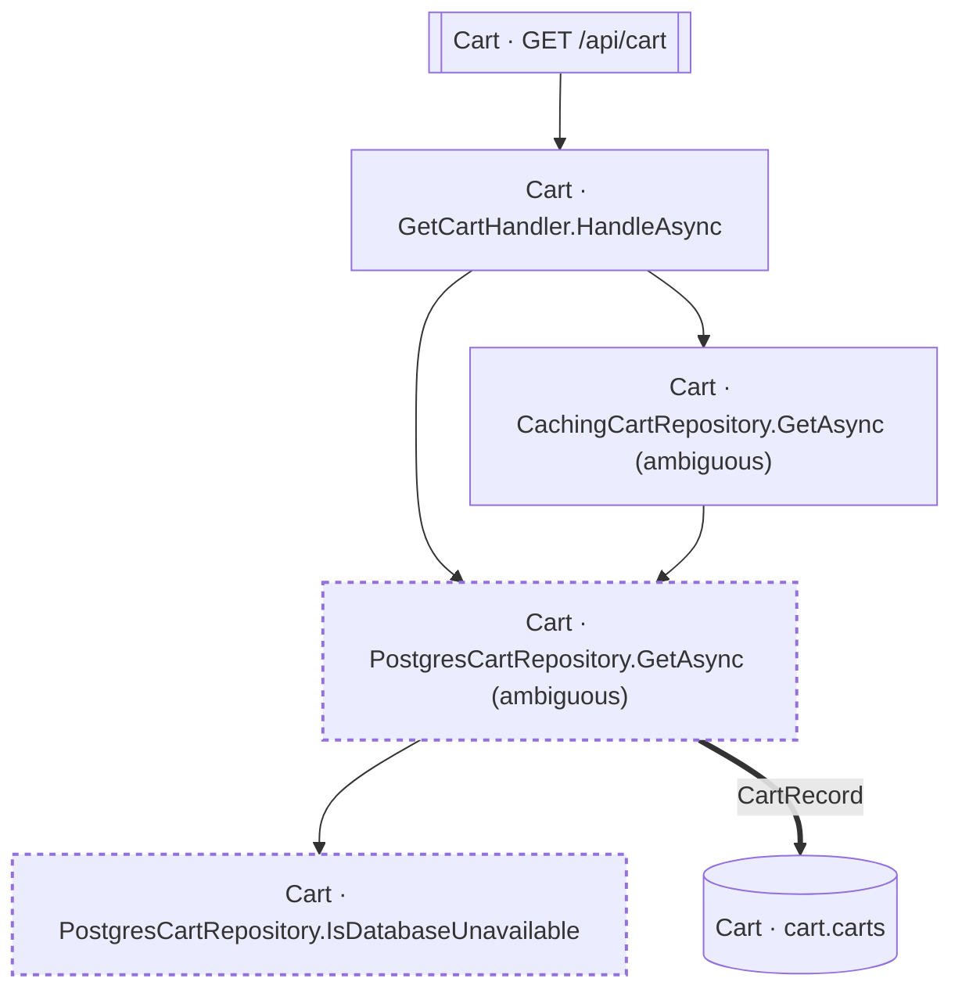

<!-- ÜRETİLMİŞ DOSYA — elle düzenlemeyin. `flowlens docs` ile yeniden üretilir. -->

# GET /api/cart

**Modül:** Cart · **Tanım:** `src/Modules/Cart/ModularCommerce.Cart.Api/Endpoints/CartEndpoints.cs:25`

> **Numaralar kaynak kodda yazılma sırasıdır**, çalışma sırası değil —
> koşullu dallar, döngüler ve erken `return`'ler ikisini ayırır.
> **`koşullu` işaretli adımlar hiç koşmayabilir**, ve bir `if`/ternary'nin iki
> dalındaki adımlar birbirini dışlar — ikisi birden koşmaz.
> Aynı numarayı taşıyan kutular **tek bir çağrıdan** gelir.

## Çağrı sırası

**GetCartHandler.HandleAsync** — `src/Modules/Cart/ModularCommerce.Cart.Application/Carts/GetCart/GetCartHandler.cs:9`

1. `GetCartHandler.cs:13` → `CachingCartRepository.GetAsync`, `PostgresCartRepository.GetAsync`

**PostgresCartRepository.GetAsync** — `src/Modules/Cart/ModularCommerce.Cart.Infrastructure/Persistence/PostgresCartRepository.cs:10`

1. `PostgresCartRepository.cs:30` *(koşullu)* → `PostgresCartRepository.IsDatabaseUnavailable`

- `cart.carts` — kaynakta bir çağrı ifadesi yok (veri kenarı ya da arayüzden implementasyona geçiş), çağrı yeri kaydedilmedi

## Veri katmanı

| Tablo | Erişim | Kolonlar | Tanım |
|---|---|---|---|
| `cart.carts` | R | — | `src/Modules/Cart/ModularCommerce.Cart.Infrastructure/Persistence/Configurations/CartConfiguration.cs:10` |

## Diyagram neyi göstermiyor

Gösterilen **6** node; ham yürüyüş **22** node'a ulaşıyor. Gizlenen: 11 ara çağrı, 4 utility, 1 arayüz bildirimi, 0 veriye ulaşmayan dal.

Tam liste: `flowlens trace "GET /api/cart"`

## Bilinen sınırlar

- **unmapped-column** — Yazilan bir property'nin kolonu yok (Ignore edilmis, hesaplanan ya da JSON alani). `property written but not mapped to a column: CartItemRecord.AddedAtUtc at src/Modules/Cart/ModularCommerce.Cart.Infrastructure/Persistence/PostgresCartRepository.cs:41 (no column)`, `property written but not mapped to a column: CartItemRecord.ProductId at src/Modules/Cart/ModularCommerce.Cart.Infrastructure/Persistence/PostgresCartRepository.cs:41 (no column)`, `property written but not mapped to a column: CartItemRecord.Quantity at src/Modules/Cart/ModularCommerce.Cart.Infrastructure/Persistence/PostgresCartRepository.cs:41 (no column)`
- **ambiguous-implementation** — Bir interface cagrisi birden fazla implementasyona aciliyor. Graph HANGISININ kostugunu KAYDETMIYOR: dekorator zinciri ve koleksiyon enjeksiyonunda hepsi kosar (dogru cevap), config anahtariyla secilende yalniz biri kosar (asiri-yaklasim). Olculen bedel: veri katmaninda 0 tablo/0 kolon, ExternalCall'da 1/1 yanlis pozitif. `src/Modules/Cart/ModularCommerce.Cart.Infrastructure/Persistence/CachingCartRepository.cs:9`, `src/Modules/Cart/ModularCommerce.Cart.Infrastructure/Persistence/PostgresCartRepository.cs:10`

> Diyagram dar görünüyorsa tıklayarak büyütebilir veya
> [mermaid.live'da açabilirsiniz](https://mermaid.live/edit#pako:eAEBSQK2_XsiY29kZSI6ImZsb3djaGFydCBURFxuICBuMFtcIkNhcnQgwrcgR2V0Q2FydEhhbmRsZXIuSGFuZGxlQXN5bmNcIl1cbiAgbjFbXCJDYXJ0IMK3IENhY2hpbmdDYXJ0UmVwb3NpdG9yeS5HZXRBc3luYyAoYW1iaWd1b3VzKVwiXVxuICBuMltcIkNhcnQgwrcgUG9zdGdyZXNDYXJ0UmVwb3NpdG9yeS5HZXRBc3luYyAoYW1iaWd1b3VzKVwiXVxuICBuM1tcIkNhcnQgwrcgUG9zdGdyZXNDYXJ0UmVwb3NpdG9yeS5Jc0RhdGFiYXNlVW5hdmFpbGFibGVcIl1cbiAgbjRbW1wiQ2FydCDCtyBHRVQgL2FwaS9jYXJ0XCJdXVxuICBuNVsoXCJDYXJ0IMK3IGNhcnQuY2FydHNcIildXG5cbiAgbjAgLS0-IG4xXG4gIG4wIC0tPiBuMlxuICBuMSAtLT4gbjJcbiAgbjIgLS0-IG4zXG4gIG4yID09PnxcIkNhcnRSZWNvcmRcInwgbjVcbiAgbjQgLS0-IG4wXG5cbiAgY2xhc3NEZWYgdW5zZWVuIHN0cm9rZS1kYXNoYXJyYXk6IDQgNCxzdHJva2Utd2lkdGg6MnB4XG4gIGNsYXNzIG4yLG4zIHVuc2VlblxuIiwibWVybWFpZCI6IntcbiAgXCJ0aGVtZVwiOiBcImRlZmF1bHRcIlxufSIsImF1dG9TeW5jIjp0cnVlLCJ1cGRhdGVEaWFncmFtIjp0cnVlfe9nx3w).
