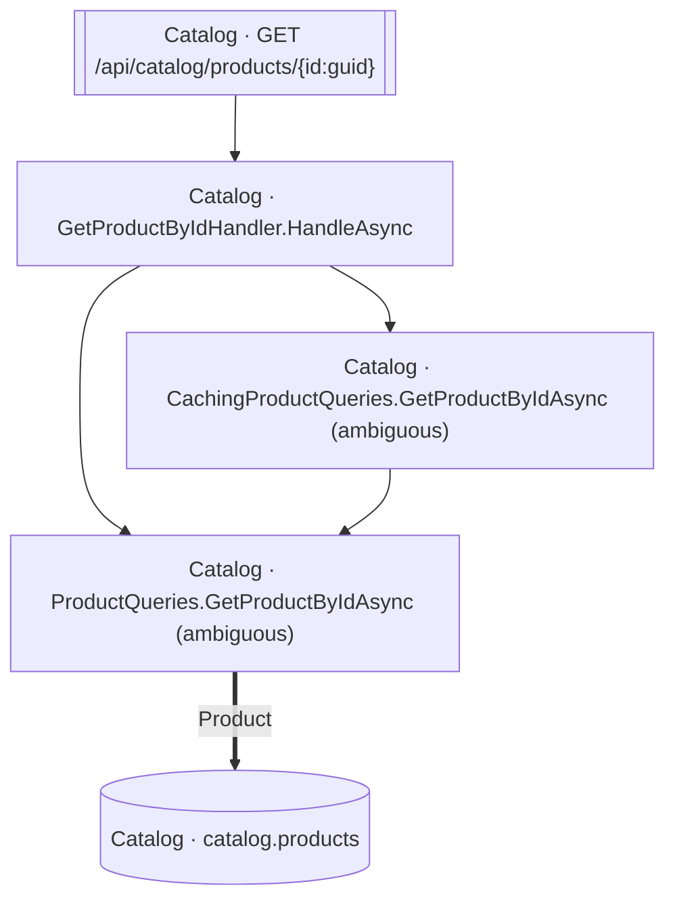

<!-- ÜRETİLMİŞ DOSYA — elle düzenlemeyin. `flowlens docs` ile yeniden üretilir. -->

# GET /api/catalog/products/{id:guid}

**Modül:** Catalog · **Tanım:** `src/Modules/Catalog/ModularCommerce.Catalog.Api/Endpoints/ProductEndpoints.cs:33`

> **Numaralar kaynak kodda yazılma sırasıdır**, çalışma sırası değil —
> koşullu dallar, döngüler ve erken `return`'ler ikisini ayırır.
> **`koşullu` işaretli adımlar hiç koşmayabilir**, ve bir `if`/ternary'nin iki
> dalındaki adımlar birbirini dışlar — ikisi birden koşmaz.
> Aynı numarayı taşıyan kutular **tek bir çağrıdan** gelir.

## Çağrı sırası

**GetProductByIdHandler.HandleAsync** — `src/Modules/Catalog/ModularCommerce.Catalog.Application/Products/GetProductById/GetProductByIdHandler.cs:10`

1. `GetProductByIdHandler.cs:15` → `CachingProductQueries.GetProductByIdAsync`, `ProductQueries.GetProductByIdAsync`

## Veri katmanı

| Tablo | Erişim | Kolonlar | Tanım |
|---|---|---|---|
| `catalog.products` | R | — | `src/Modules/Catalog/ModularCommerce.Catalog.Infrastructure/Persistence/Configurations/ProductConfiguration.cs:11` |

## Diyagram neyi göstermiyor

Gösterilen **5** node; ham yürüyüş **17** node'a ulaşıyor. Gizlenen: 7 ara çağrı, 4 utility, 1 arayüz bildirimi, 0 veriye ulaşmayan dal.

Tam liste: `flowlens trace "GET /api/catalog/products/{id:guid}"`

## Bilinen sınırlar

- **ambiguous-implementation** — Bir interface cagrisi birden fazla implementasyona aciliyor. Graph HANGISININ kostugunu KAYDETMIYOR: dekorator zinciri ve koleksiyon enjeksiyonunda hepsi kosar (dogru cevap), config anahtariyla secilende yalniz biri kosar (asiri-yaklasim). Olculen bedel: veri katmaninda 0 tablo/0 kolon, ExternalCall'da 1/1 yanlis pozitif. `src/Modules/Catalog/ModularCommerce.Catalog.Infrastructure/Caching/CachingProductQueries.cs:20`, `src/Modules/Catalog/ModularCommerce.Catalog.Infrastructure/Persistence/Queries/ProductQueries.cs:52`

> Diyagram dar görünüyorsa tıklayarak büyütebilir veya
> [mermaid.live'da açabilirsiniz](https://mermaid.live/edit#pako:eAEB5wEY_nsiY29kZSI6ImZsb3djaGFydCBURFxuICBuMFtcIkNhdGFsb2cgwrcgR2V0UHJvZHVjdEJ5SWRIYW5kbGVyLkhhbmRsZUFzeW5jXCJdXG4gIG4xW1wiQ2F0YWxvZyDCtyBDYWNoaW5nUHJvZHVjdFF1ZXJpZXMuR2V0UHJvZHVjdEJ5SWRBc3luYyAoYW1iaWd1b3VzKVwiXVxuICBuMltcIkNhdGFsb2cgwrcgUHJvZHVjdFF1ZXJpZXMuR2V0UHJvZHVjdEJ5SWRBc3luYyAoYW1iaWd1b3VzKVwiXVxuICBuM1tbXCJDYXRhbG9nIMK3IEdFVCAvYXBpL2NhdGFsb2cvcHJvZHVjdHMve2lkOmd1aWR9XCJdXVxuICBuNFsoXCJDYXRhbG9nIMK3IGNhdGFsb2cucHJvZHVjdHNcIildXG5cbiAgbjAgLS0-IG4xXG4gIG4wIC0tPiBuMlxuICBuMSAtLT4gbjJcbiAgbjIgPT0-fFwiUHJvZHVjdFwifCBuNFxuICBuMyAtLT4gbjBcbiIsIm1lcm1haWQiOiJ7XG4gIFwidGhlbWVcIjogXCJkZWZhdWx0XCJcbn0iLCJhdXRvU3luYyI6dHJ1ZSwidXBkYXRlRGlhZ3JhbSI6dHJ1ZX0Pm6dG).
