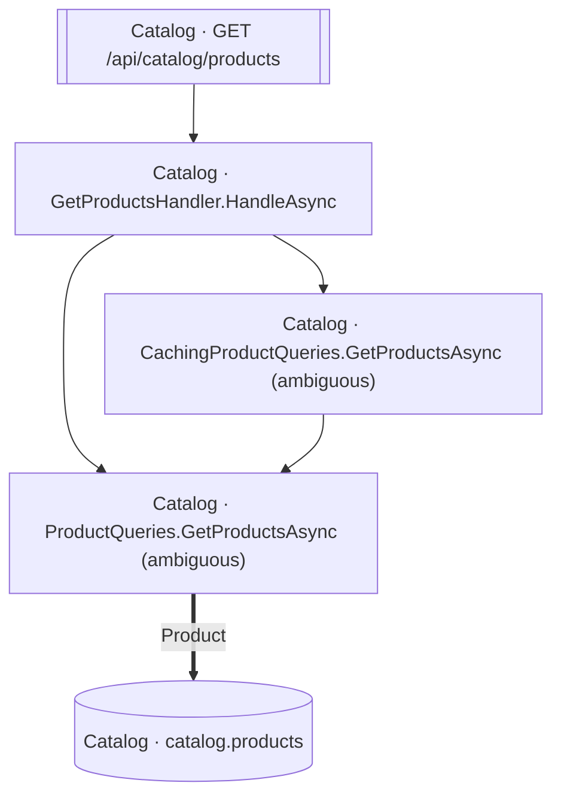

<!-- ÜRETİLMİŞ DOSYA — elle düzenlemeyin. `flowlens docs` ile yeniden üretilir. -->

# GET /api/catalog/products

**Modül:** Catalog · **Tanım:** `src/Modules/Catalog/ModularCommerce.Catalog.Api/Endpoints/ProductEndpoints.cs:24`

## Veri katmanı

| Tablo | Erişim | Kolonlar | Tanım |
|---|---|---|---|
| `catalog.products` | R | — | `src/Modules/Catalog/ModularCommerce.Catalog.Infrastructure/Persistence/Configurations/ProductConfiguration.cs:11` |

## Diyagram neyi göstermiyor

Gösterilen **5** node; ham yürüyüş **11** node'a ulaşıyor. Gizlenen: 1 ara çağrı, 4 utility, 1 arayüz bildirimi, 0 veriye ulaşmayan dal.

Tam liste: `flowlens trace "GET /api/catalog/products"`

## Bilinen sınırlar

- **ambiguous-implementation** — Bir interface cagrisi birden fazla implementasyona aciliyor. Graph HANGISININ kostugunu KAYDETMIYOR: dekorator zinciri ve koleksiyon enjeksiyonunda hepsi kosar (dogru cevap), config anahtariyla secilende yalniz biri kosar (asiri-yaklasim). Olculen bedel: veri katmaninda 0 tablo/0 kolon, ExternalCall'da 1/1 yanlis pozitif. `src/Modules/Catalog/ModularCommerce.Catalog.Infrastructure/Caching/CachingProductQueries.cs:15`, `src/Modules/Catalog/ModularCommerce.Catalog.Infrastructure/Persistence/Queries/ProductQueries.cs:11`

> Diyagram dar görünüyorsa tıklayarak büyütebilir veya
> [mermaid.live'da açabilirsiniz](https://mermaid.live/edit#pako:eAEB1AEr_nsiY29kZSI6ImZsb3djaGFydCBURFxuICBuMFtcIkNhdGFsb2cgwrcgR2V0UHJvZHVjdHNIYW5kbGVyLkhhbmRsZUFzeW5jXCJdXG4gIG4xW1wiQ2F0YWxvZyDCtyBDYWNoaW5nUHJvZHVjdFF1ZXJpZXMuR2V0UHJvZHVjdHNBc3luYyAoYW1iaWd1b3VzKVwiXVxuICBuMltcIkNhdGFsb2cgwrcgUHJvZHVjdFF1ZXJpZXMuR2V0UHJvZHVjdHNBc3luYyAoYW1iaWd1b3VzKVwiXVxuICBuM1tbXCJDYXRhbG9nIMK3IEdFVCAvYXBpL2NhdGFsb2cvcHJvZHVjdHNcIl1dXG4gIG40WyhcIkNhdGFsb2cgwrcgY2F0YWxvZy5wcm9kdWN0c1wiKV1cblxuICBuMCAtLT4gbjFcbiAgbjAgLS0-IG4yXG4gIG4xIC0tPiBuMlxuICBuMiA9PT58XCJQcm9kdWN0XCJ8IG40XG4gIG4zIC0tPiBuMFxuIiwibWVybWFpZCI6IntcbiAgXCJ0aGVtZVwiOiBcImRlZmF1bHRcIlxufSIsImF1dG9TeW5jIjp0cnVlLCJ1cGRhdGVEaWFncmFtIjp0cnVlfYa9oJA).
