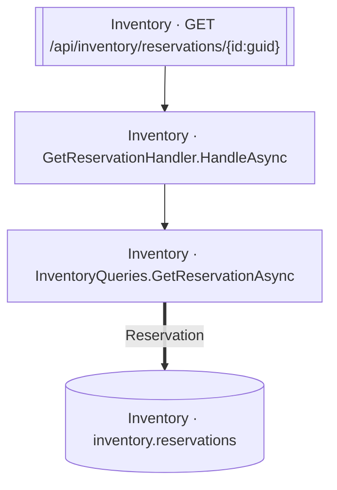

<!-- ÜRETİLMİŞ DOSYA — elle düzenlemeyin. `flowlens docs` ile yeniden üretilir. -->

# GET /api/inventory/reservations/{id:guid}

**Modül:** Inventory · **Tanım:** `src/Modules/Inventory/ModularCommerce.Inventory.Api/Endpoints/ReservationEndpoints.cs:26`

## Veri katmanı

| Tablo | Erişim | Kolonlar | Tanım |
|---|---|---|---|
| `inventory.reservations` | R | — | `src/Modules/Inventory/ModularCommerce.Inventory.Infrastructure/Persistence/Configurations/ReservationConfiguration.cs:11` |

## Diyagram neyi göstermiyor

Gösterilen **4** node; ham yürüyüş **11** node'a ulaşıyor. Gizlenen: 2 ara çağrı, 4 utility, 1 arayüz bildirimi, 0 veriye ulaşmayan dal.

Tam liste: `flowlens trace "GET /api/inventory/reservations/{id:guid}"`

## Bilinen sınırlar

Bu sayfa için kaydedilmiş bir sınır yok.

> Diyagram dar görünüyorsa tıklayarak büyütebilir veya
> [mermaid.live'da açabilirsiniz](https://mermaid.live/edit#pako:eAEBjwFw_nsiY29kZSI6ImZsb3djaGFydCBURFxuICBuMFtcIkludmVudG9yeSDCtyBHZXRSZXNlcnZhdGlvbkhhbmRsZXIuSGFuZGxlQXN5bmNcIl1cbiAgbjFbXCJJbnZlbnRvcnkgwrcgSW52ZW50b3J5UXVlcmllcy5HZXRSZXNlcnZhdGlvbkFzeW5jXCJdXG4gIG4yW1tcIkludmVudG9yeSDCtyBHRVQgL2FwaS9pbnZlbnRvcnkvcmVzZXJ2YXRpb25zL3tpZDpndWlkfVwiXV1cbiAgbjNbKFwiSW52ZW50b3J5IMK3IGludmVudG9yeS5yZXNlcnZhdGlvbnNcIildXG5cbiAgbjAgLS0-IG4xXG4gIG4xID09PnxcIlJlc2VydmF0aW9uXCJ8IG4zXG4gIG4yIC0tPiBuMFxuIiwibWVybWFpZCI6IntcbiAgXCJ0aGVtZVwiOiBcImRlZmF1bHRcIlxufSIsImF1dG9TeW5jIjp0cnVlLCJ1cGRhdGVEaWFncmFtIjp0cnVlfWRQjbc).
