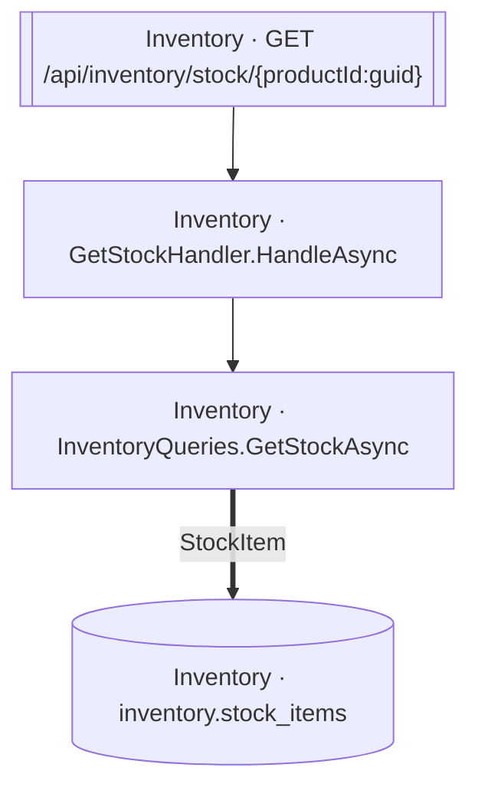

<!-- ÜRETİLMİŞ DOSYA — elle düzenlemeyin. `flowlens docs` ile yeniden üretilir. -->

# GET /api/inventory/stock/{productId:guid}

**Modül:** Inventory · **Tanım:** `src/Modules/Inventory/ModularCommerce.Inventory.Api/Endpoints/StockEndpoints.cs:17`

## Veri katmanı

| Tablo | Erişim | Kolonlar | Tanım |
|---|---|---|---|
| `inventory.stock_items` | R | — | `src/Modules/Inventory/ModularCommerce.Inventory.Infrastructure/Persistence/Configurations/StockItemConfiguration.cs:11` |

## Diyagram neyi göstermiyor

Gösterilen **4** node; ham yürüyüş **11** node'a ulaşıyor. Gizlenen: 2 ara çağrı, 4 utility, 1 arayüz bildirimi, 0 veriye ulaşmayan dal.

Tam liste: `flowlens trace "GET /api/inventory/stock/{productId:guid}"`

## Bilinen sınırlar

Bu sayfa için kaydedilmiş bir sınır yok.

> Diyagram dar görünüyorsa tıklayarak büyütebilir veya
> [mermaid.live'da açabilirsiniz](https://mermaid.live/edit#pako:eAEBgAF__nsiY29kZSI6ImZsb3djaGFydCBURFxuICBuMFtcIkludmVudG9yeSDCtyBHZXRTdG9ja0hhbmRsZXIuSGFuZGxlQXN5bmNcIl1cbiAgbjFbXCJJbnZlbnRvcnkgwrcgSW52ZW50b3J5UXVlcmllcy5HZXRTdG9ja0FzeW5jXCJdXG4gIG4yW1tcIkludmVudG9yeSDCtyBHRVQgL2FwaS9pbnZlbnRvcnkvc3RvY2sve3Byb2R1Y3RJZDpndWlkfVwiXV1cbiAgbjNbKFwiSW52ZW50b3J5IMK3IGludmVudG9yeS5zdG9ja19pdGVtc1wiKV1cblxuICBuMCAtLT4gbjFcbiAgbjEgPT0-fFwiU3RvY2tJdGVtXCJ8IG4zXG4gIG4yIC0tPiBuMFxuIiwibWVybWFpZCI6IntcbiAgXCJ0aGVtZVwiOiBcImRlZmF1bHRcIlxufSIsImF1dG9TeW5jIjp0cnVlLCJ1cGRhdGVEaWFncmFtIjp0cnVlfdQQhvw).
