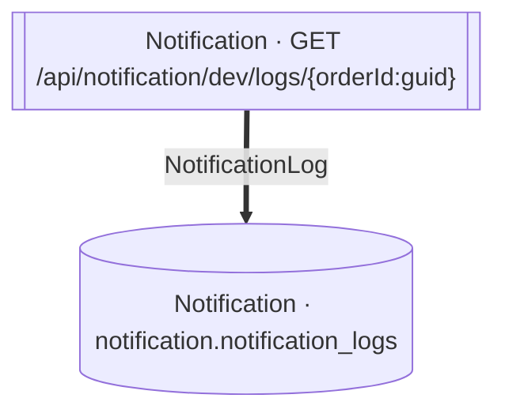

<!-- ÜRETİLMİŞ DOSYA — elle düzenlemeyin. `flowlens docs` ile yeniden üretilir. -->

# GET /api/notification/dev/logs/{orderId:guid}

**Modül:** Notification · **Tanım:** `src/Modules/Notification/ModularCommerce.Notification.Api/Endpoints/NotificationDevEndpoints.cs:18`

## Veri katmanı

| Tablo | Erişim | Kolonlar | Tanım |
|---|---|---|---|
| `notification.notification_logs` | R | — | `src/Modules/Notification/ModularCommerce.Notification.Infrastructure/Persistence/Configurations/NotificationLogConfiguration.cs:11` |

## Diyagram neyi göstermiyor

Gösterilen **2** node; ham yürüyüş **3** node'a ulaşıyor. Gizlenen: 1 ara çağrı, 0 utility, 0 arayüz bildirimi, 0 veriye ulaşmayan dal.

Tam liste: `flowlens trace "GET /api/notification/dev/logs/{orderId:guid}"`

## Bilinen sınırlar

Bu sayfa için kaydedilmiş bir sınır yok.

> Diyagram dar görünüyorsa tıklayarak büyütebilir veya
> [mermaid.live'da açabilirsiniz](https://mermaid.live/edit#pako:eAEBFAHr_nsiY29kZSI6ImZsb3djaGFydCBURFxuICBuMFtbXCJOb3RpZmljYXRpb24gwrcgR0VUIC9hcGkvbm90aWZpY2F0aW9uL2Rldi9sb2dzL3tvcmRlcklkOmd1aWR9XCJdXVxuICBuMVsoXCJOb3RpZmljYXRpb24gwrcgbm90aWZpY2F0aW9uLm5vdGlmaWNhdGlvbl9sb2dzXCIpXVxuXG4gIG4wID09PnxcIk5vdGlmaWNhdGlvbkxvZ1wifCBuMVxuIiwibWVybWFpZCI6IntcbiAgXCJ0aGVtZVwiOiBcImRlZmF1bHRcIlxufSIsImF1dG9TeW5jIjp0cnVlLCJ1cGRhdGVEaWFncmFtIjp0cnVlfWOaYgM).
