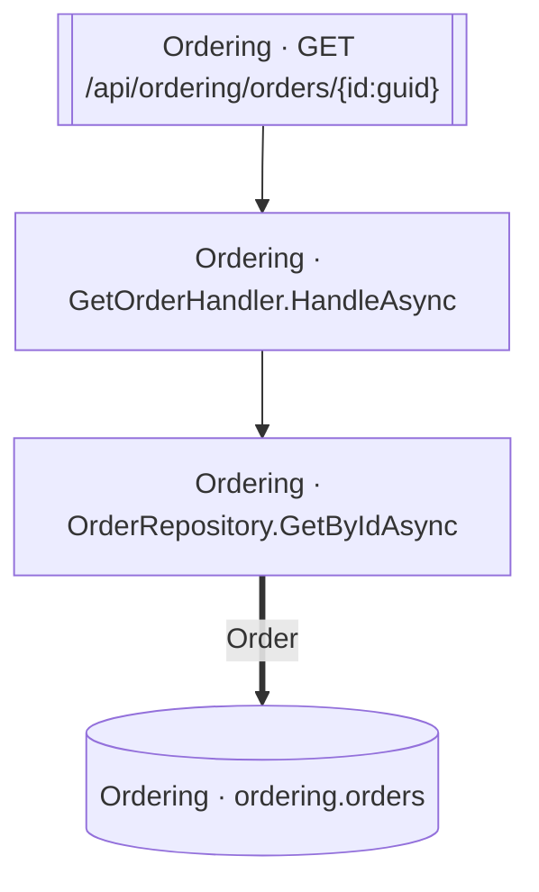

<!-- ÜRETİLMİŞ DOSYA — elle düzenlemeyin. `flowlens docs` ile yeniden üretilir. -->

# GET /api/ordering/orders/{id:guid}

**Modül:** Ordering · **Tanım:** `src/Modules/Ordering/ModularCommerce.Ordering.Api/Endpoints/OrderEndpoints.cs:42`

## Veri katmanı

| Tablo | Erişim | Kolonlar | Tanım |
|---|---|---|---|
| `ordering.orders` | R | — | `src/Modules/Ordering/ModularCommerce.Ordering.Infrastructure/Persistence/Configurations/OrderConfiguration.cs:13` |

## Diyagram neyi göstermiyor

Gösterilen **4** node; ham yürüyüş **13** node'a ulaşıyor. Gizlenen: 3 ara çağrı, 5 utility, 1 arayüz bildirimi, 0 veriye ulaşmayan dal.

Tam liste: `flowlens trace "GET /api/ordering/orders/{id:guid}"`

## Bilinen sınırlar

Bu sayfa için kaydedilmiş bir sınır yok.

> Diyagram dar görünüyorsa tıklayarak büyütebilir veya
> [mermaid.live'da açabilirsiniz](https://mermaid.live/edit#pako:eAEBaQGW_nsiY29kZSI6ImZsb3djaGFydCBURFxuICBuMFtcIk9yZGVyaW5nIMK3IEdldE9yZGVySGFuZGxlci5IYW5kbGVBc3luY1wiXVxuICBuMVtcIk9yZGVyaW5nIMK3IE9yZGVyUmVwb3NpdG9yeS5HZXRCeUlkQXN5bmNcIl1cbiAgbjJbW1wiT3JkZXJpbmcgwrcgR0VUIC9hcGkvb3JkZXJpbmcvb3JkZXJzL3tpZDpndWlkfVwiXV1cbiAgbjNbKFwiT3JkZXJpbmcgwrcgb3JkZXJpbmcub3JkZXJzXCIpXVxuXG4gIG4wIC0tPiBuMVxuICBuMSA9PT58XCJPcmRlclwifCBuM1xuICBuMiAtLT4gbjBcbiIsIm1lcm1haWQiOiJ7XG4gIFwidGhlbWVcIjogXCJkZWZhdWx0XCJcbn0iLCJhdXRvU3luYyI6dHJ1ZSwidXBkYXRlRGlhZ3JhbSI6dHJ1ZX2xnXxN).
