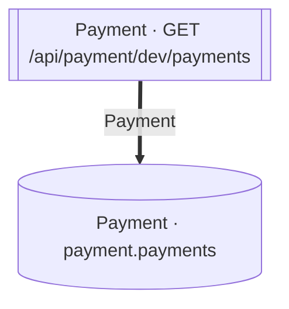

<!-- ÜRETİLMİŞ DOSYA — elle düzenlemeyin. `flowlens docs` ile yeniden üretilir. -->

# GET /api/payment/dev/payments

**Modül:** Payment · **Tanım:** `src/Modules/Payment/ModularCommerce.Payment.Api/Endpoints/PaymentDevEndpoints.cs:22`

## Veri katmanı

| Tablo | Erişim | Kolonlar | Tanım |
|---|---|---|---|
| `payment.payments` | R | — | `src/Modules/Payment/ModularCommerce.Payment.Infrastructure/Persistence/Configurations/PaymentConfiguration.cs:14` |

## Diyagram neyi göstermiyor

Gösterilen **2** node; ham yürüyüş **3** node'a ulaşıyor. Gizlenen: 1 ara çağrı, 0 utility, 0 arayüz bildirimi, 0 veriye ulaşmayan dal.

Tam liste: `flowlens trace "GET /api/payment/dev/payments"`

## Bilinen sınırlar

Bu sayfa için kaydedilmiş bir sınır yok.

> Diyagram dar görünüyorsa tıklayarak büyütebilir veya
> [mermaid.live'da açabilirsiniz](https://mermaid.live/edit#pako:eAEB5AAb_3siY29kZSI6ImZsb3djaGFydCBURFxuICBuMFtbXCJQYXltZW50IMK3IEdFVCAvYXBpL3BheW1lbnQvZGV2L3BheW1lbnRzXCJdXVxuICBuMVsoXCJQYXltZW50IMK3IHBheW1lbnQucGF5bWVudHNcIildXG5cbiAgbjAgPT0-fFwiUGF5bWVudFwifCBuMVxuIiwibWVybWFpZCI6IntcbiAgXCJ0aGVtZVwiOiBcImRlZmF1bHRcIlxufSIsImF1dG9TeW5jIjp0cnVlLCJ1cGRhdGVEaWFncmFtIjp0cnVlfVhVTvM).
