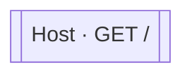

<!-- ÜRETİLMİŞ DOSYA — elle düzenlemeyin. `flowlens docs` ile yeniden üretilir. -->

# GET /

**Modül:** Host · **Tanım:** `src/Bootstrapper/ModularCommerce.Host/Program.cs:79`

> **Bu endpoint hiçbir veriye dokunmuyor.** Çağrı yok, tablo yok, event yok —
> gövdesi yalnız statik bir yanıt döndürüyor (`src/Bootstrapper/ModularCommerce.Host/Program.cs:79`).
> Boş küme burada doğru cevap ve kaynakta doğrulandı.

## Diyagram neyi göstermiyor

Gösterilen **1** node; ham yürüyüş **1** node'a ulaşıyor. Gizlenen: 0 ara çağrı, 0 utility, 0 arayüz bildirimi, 0 veriye ulaşmayan dal.

Tam liste: `flowlens trace "GET /"`

## Bilinen sınırlar

Bu sayfa için kaydedilmiş bir sınır yok.

> Diyagram dar görünüyorsa tıklayarak büyütebilir veya
> [mermaid.live'da açabilirsiniz](https://mermaid.live/edit#pako:eAEBhgB5_3siY29kZSI6ImZsb3djaGFydCBURFxuICBuMFtbXCJIb3N0IMK3IEdFVCAvXCJdXVxuXG4iLCJtZXJtYWlkIjoie1xuICBcInRoZW1lXCI6IFwiZGVmYXVsdFwiXG59IiwiYXV0b1N5bmMiOnRydWUsInVwZGF0ZURpYWdyYW0iOnRydWV9rdctSw).
