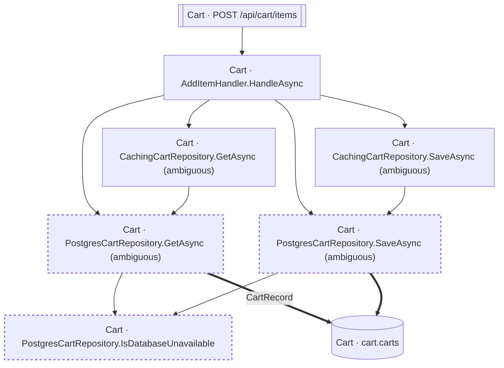

<!-- ÜRETİLMİŞ DOSYA — elle düzenlemeyin. `flowlens docs` ile yeniden üretilir. -->

# POST /api/cart/items

**Modül:** Cart · **Tanım:** `src/Modules/Cart/ModularCommerce.Cart.Api/Endpoints/CartEndpoints.cs:34`

## Veri katmanı

| Tablo | Erişim | Kolonlar | Tanım |
|---|---|---|---|
| `cart.carts` | WR | `CustomerId`, `Items`, `UpdatedAtUtc` | `src/Modules/Cart/ModularCommerce.Cart.Infrastructure/Persistence/Configurations/CartConfiguration.cs:10` |

## Diyagram neyi göstermiyor

Gösterilen **8** node; ham yürüyüş **33** node'a ulaşıyor. Gizlenen: 16 ara çağrı, 7 utility, 2 arayüz bildirimi, 0 veriye ulaşmayan dal.

Tam liste: `flowlens trace "POST /api/cart/items"`

## Bilinen sınırlar

- **unmapped-column** — Yazilan bir property'nin kolonu yok (Ignore edilmis, hesaplanan ya da JSON alani). `property written but not mapped to a column: CartItemRecord.AddedAtUtc at src/Modules/Cart/ModularCommerce.Cart.Infrastructure/Persistence/PostgresCartRepository.cs:41 (no column)`, `property written but not mapped to a column: CartItemRecord.ProductId at src/Modules/Cart/ModularCommerce.Cart.Infrastructure/Persistence/PostgresCartRepository.cs:41 (no column)`, `property written but not mapped to a column: CartItemRecord.Quantity at src/Modules/Cart/ModularCommerce.Cart.Infrastructure/Persistence/PostgresCartRepository.cs:41 (no column)`
- **second-class-evidence** — Bazi yazma iddialari dolayli kanita dayaniyor: entity insasi ya da parametreli bir SaveChanges. Dogru olabilir, ama dogrudan okunmus degil. `new CartItemRecord(...) at src/Modules/Cart/ModularCommerce.Cart.Infrastructure/Persistence/PostgresCartRepository.cs:41`, `new CartRecord(...) at src/Modules/Cart/ModularCommerce.Cart.Infrastructure/Persistence/PostgresCartRepository.cs:49`
- **ambiguous-implementation** — Bir interface cagrisi birden fazla implementasyona aciliyor. Graph HANGISININ kostugunu KAYDETMIYOR: dekorator zinciri ve koleksiyon enjeksiyonunda hepsi kosar (dogru cevap), config anahtariyla secilende yalniz biri kosar (asiri-yaklasim). Olculen bedel: veri katmaninda 0 tablo/0 kolon, ExternalCall'da 1/1 yanlis pozitif. `src/Modules/Cart/ModularCommerce.Cart.Infrastructure/Persistence/CachingCartRepository.cs:26`, `src/Modules/Cart/ModularCommerce.Cart.Infrastructure/Persistence/CachingCartRepository.cs:9`, `src/Modules/Cart/ModularCommerce.Cart.Infrastructure/Persistence/PostgresCartRepository.cs:10`, `src/Modules/Cart/ModularCommerce.Cart.Infrastructure/Persistence/PostgresCartRepository.cs:36`

> Diyagram dar görünüyorsa tıklayarak büyütebilir veya
> [mermaid.live'da açabilirsiniz](https://mermaid.live/edit#pako:eAEBEwPs_HsiY29kZSI6ImZsb3djaGFydCBURFxuICBuMFtcIkNhcnQgwrcgQWRkSXRlbUhhbmRsZXIuSGFuZGxlQXN5bmNcIl1cbiAgbjFbXCJDYXJ0IMK3IENhY2hpbmdDYXJ0UmVwb3NpdG9yeS5HZXRBc3luYyAoYW1iaWd1b3VzKVwiXVxuICBuMltcIkNhcnQgwrcgQ2FjaGluZ0NhcnRSZXBvc2l0b3J5LlNhdmVBc3luYyAoYW1iaWd1b3VzKVwiXVxuICBuM1tcIkNhcnQgwrcgUG9zdGdyZXNDYXJ0UmVwb3NpdG9yeS5HZXRBc3luYyAoYW1iaWd1b3VzKVwiXVxuICBuNFtcIkNhcnQgwrcgUG9zdGdyZXNDYXJ0UmVwb3NpdG9yeS5Jc0RhdGFiYXNlVW5hdmFpbGFibGVcIl1cbiAgbjVbXCJDYXJ0IMK3IFBvc3RncmVzQ2FydFJlcG9zaXRvcnkuU2F2ZUFzeW5jIChhbWJpZ3VvdXMpXCJdXG4gIG42W1tcIkNhcnQgwrcgUE9TVCAvYXBpL2NhcnQvaXRlbXNcIl1dXG4gIG43WyhcIkNhcnQgwrcgY2FydC5jYXJ0c1wiKV1cblxuICBuMCAtLT4gbjFcbiAgbjAgLS0-IG4yXG4gIG4wIC0tPiBuM1xuICBuMCAtLT4gbjVcbiAgbjEgLS0-IG4zXG4gIG4yIC0tPiBuNVxuICBuMyAtLT4gbjRcbiAgbjMgPT0-fFwiQ2FydFJlY29yZFwifCBuN1xuICBuNSAtLT4gbjRcbiAgbjUgPT0-IG43XG4gIG42IC0tPiBuMFxuXG4gIGNsYXNzRGVmIHVuc2VlbiBzdHJva2UtZGFzaGFycmF5OiA0IDQsc3Ryb2tlLXdpZHRoOjJweFxuICBjbGFzcyBuMyxuNCxuNSB1bnNlZW5cbiIsIm1lcm1haWQiOiJ7XG4gIFwidGhlbWVcIjogXCJkZWZhdWx0XCJcbn0iLCJhdXRvU3luYyI6dHJ1ZSwidXBkYXRlRGlhZ3JhbSI6dHJ1ZX3aCgm2).
