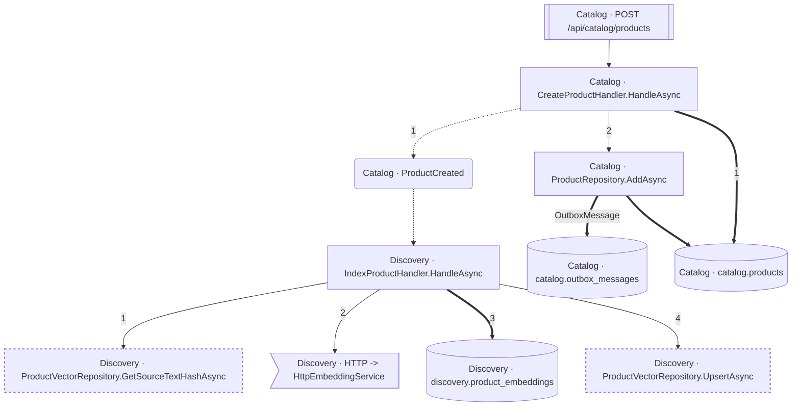

<!-- ÜRETİLMİŞ DOSYA — elle düzenlemeyin. `flowlens docs` ile yeniden üretilir. -->

# POST /api/catalog/products

**Modül:** Catalog · **Tanım:** `src/Modules/Catalog/ModularCommerce.Catalog.Api/Endpoints/ProductEndpoints.cs:43`

> **Numaralar kaynak kodda yazılma sırasıdır**, çalışma sırası değil —
> koşullu dallar, döngüler ve erken `return`'ler ikisini ayırır.
> **`koşullu` işaretli adımlar hiç koşmayabilir**, ve bir `if`/ternary'nin iki
> dalındaki adımlar birbirini dışlar — ikisi birden koşmaz.
> Aynı numarayı taşıyan kutular **tek bir çağrıdan** gelir.

## Çağrı sırası

**CreateProductHandler.HandleAsync** — `src/Modules/Catalog/ModularCommerce.Catalog.Application/Products/CreateProduct/CreateProductHandler.cs:11`

1. `CreateProductHandler.cs:27` → `ProductCreated`, `catalog.products`
2. `CreateProductHandler.cs:34` → `ProductRepository.AddAsync`

**ProductRepository.AddAsync** — `src/Modules/Catalog/ModularCommerce.Catalog.Infrastructure/Persistence/Repositories/ProductRepository.cs:18`

- `catalog.outbox_messages` — kaynakta bir çağrı ifadesi yok (veri kenarı ya da arayüzden implementasyona geçiş), çağrı yeri kaydedilmedi
- `catalog.products` — kaynakta bir çağrı ifadesi yok (veri kenarı ya da arayüzden implementasyona geçiş), çağrı yeri kaydedilmedi

**IndexProductHandler.HandleAsync** — `src/Modules/Discovery/ModularCommerce.Discovery.Application/Indexing/IndexProductHandler.cs:18`

1. `IndexProductHandler.cs:23` → `ProductVectorRepository.GetSourceTextHashAsync`
2. `IndexProductHandler.cs:30` → `HTTP -> HttpEmbeddingService`
3. `IndexProductHandler.cs:36` → `discovery.product_embeddings`
4. `IndexProductHandler.cs:42` → `ProductVectorRepository.UpsertAsync`

## Veri katmanı

| Tablo | Erişim | Kolonlar | Tanım |
|---|---|---|---|
| `catalog.outbox_messages` | W | — | `src/Modules/Catalog/ModularCommerce.Catalog.Infrastructure/Outbox/OutboxMessageConfiguration.cs:10` |
| `catalog.products` | W | `CreatedAtUtc`, `Description`, `Id`, `IsActive`, `Name`, `Sku`, `StockQuantity`, `UpdatedAtUtc`, `price_amount`, `price_currency` | `src/Modules/Catalog/ModularCommerce.Catalog.Infrastructure/Persistence/Configurations/ProductConfiguration.cs:11` |
| `discovery.product_embeddings` | W | `ProductId`, `SourceTextHash`, `UpdatedAtUtc` | `src/Modules/Discovery/ModularCommerce.Discovery.Infrastructure/Persistence/Configurations/ProductEmbeddingConfiguration.cs:11` |

## Diyagram neyi göstermiyor

Gösterilen **11** node; ham yürüyüş **52** node'a ulaşıyor. Gizlenen: 28 ara çağrı, 8 utility, 3 arayüz bildirimi, 2 veriye ulaşmayan dal.

Tam liste: `flowlens trace "POST /api/catalog/products"`

## Bilinen sınırlar

- **raw-sql** — Bu akis ham SQL kullaniyor; o erisimin tablosu bu listede YOK. `raw SQL reaches the database outside the model, so no table edge: dataSource.CreateCommand at src/Modules/Discovery/ModularCommerce.Discovery.Infrastructure/Persistence/ProductVectorRepository.cs:26`, `raw SQL reaches the database outside the model, so no table edge: dataSource.CreateCommand at src/Modules/Discovery/ModularCommerce.Discovery.Infrastructure/Persistence/ProductVectorRepository.cs:40`, `raw SQL reaches the database outside the model, so no table edge: dataSource.CreateCommand at src/Modules/Discovery/ModularCommerce.Discovery.Infrastructure/Persistence/ProductVectorRepository.cs:60`
- **second-class-evidence** — Bazi yazma iddialari dolayli kanita dayaniyor: entity insasi ya da parametreli bir SaveChanges. Dogru olabilir, ama dogrudan okunmus degil. `new Product(...) at src/Modules/Catalog/ModularCommerce.Catalog.Domain/Products/Product.cs:65`, `new ProductEmbedding(...) at src/Modules/Discovery/ModularCommerce.Discovery.Domain/Embeddings/ProductEmbedding.cs:50`
- **ambiguous-implementation** — Bir interface cagrisi birden fazla implementasyona aciliyor. Graph HANGISININ kostugunu KAYDETMIYOR: dekorator zinciri ve koleksiyon enjeksiyonunda hepsi kosar (dogru cevap), config anahtariyla secilende yalniz biri kosar (asiri-yaklasim). Olculen bedel: veri katmaninda 0 tablo/0 kolon, ExternalCall'da 1/1 yanlis pozitif. `src/Modules/Discovery/ModularCommerce.Discovery.Infrastructure/Embedding/FakeEmbeddingService.cs:17`, `src/Modules/Discovery/ModularCommerce.Discovery.Infrastructure/Embedding/HttpEmbeddingService.cs:29`
- **interceptor-columns** — Bir SaveChanges interceptor'inin yazdigi tablolar TABLO duzeyinde dogru, KOLON duzeyinde bos: interceptor'i EF cagirir, kod degil, dolayisiyla govdesindeki atamalar hicbir akisin ulasilabilir kumesinde degil (known-limitations L16-4). `entity:ModularCommerce.Catalog.Infrastructure.Outbox.OutboxMessage`

> Diyagram dar görünüyorsa tıklayarak büyütebilir veya
> [mermaid.live'da açabilirsiniz](https://mermaid.live/edit#pako:eAEB1wMo_HsiY29kZSI6ImZsb3djaGFydCBURFxuICBuMFtcIkNhdGFsb2cgwrcgQ3JlYXRlUHJvZHVjdEhhbmRsZXIuSGFuZGxlQXN5bmNcIl1cbiAgbjFbXCJDYXRhbG9nIMK3IFByb2R1Y3RSZXBvc2l0b3J5LkFkZEFzeW5jXCJdXG4gIG4yW1wiRGlzY292ZXJ5IMK3IEluZGV4UHJvZHVjdEhhbmRsZXIuSGFuZGxlQXN5bmNcIl1cbiAgbjNbXCJEaXNjb3ZlcnkgwrcgUHJvZHVjdFZlY3RvclJlcG9zaXRvcnkuR2V0U291cmNlVGV4dEhhc2hBc3luY1wiXVxuICBuNFtcIkRpc2NvdmVyeSDCtyBQcm9kdWN0VmVjdG9yUmVwb3NpdG9yeS5VcHNlcnRBc3luY1wiXVxuICBuNVtbXCJDYXRhbG9nIMK3IFBPU1QgL2FwaS9jYXRhbG9nL3Byb2R1Y3RzXCJdXVxuICBuNihcIkNhdGFsb2cgwrcgUHJvZHVjdENyZWF0ZWRcIilcbiAgbjc-XCJEaXNjb3ZlcnkgwrcgSFRUUCAtJmd0OyBIdHRwRW1iZWRkaW5nU2VydmljZVwiXVxuICBuOFsoXCJDYXRhbG9nIMK3IGNhdGFsb2cub3V0Ym94X21lc3NhZ2VzXCIpXVxuICBuOVsoXCJDYXRhbG9nIMK3IGNhdGFsb2cucHJvZHVjdHNcIildXG4gIG4xMFsoXCJEaXNjb3ZlcnkgwrcgZGlzY292ZXJ5LnByb2R1Y3RfZW1iZWRkaW5nc1wiKV1cblxuICBuMCAtLi0-fFwiMVwifCBuNlxuICBuMCA9PT58XCIxXCJ8IG45XG4gIG4wIC0tPnxcIjJcInwgbjFcbiAgbjEgPT0-fFwiT3V0Ym94TWVzc2FnZVwifCBuOFxuICBuMSA9PT4gbjlcbiAgbjIgLS0-fFwiMVwifCBuM1xuICBuMiAtLT58XCIyXCJ8IG43XG4gIG4yID09PnxcIjNcInwgbjEwXG4gIG4yIC0tPnxcIjRcInwgbjRcbiAgbjUgLS0-IG4wXG4gIG42IC0uLT4gbjJcblxuICBjbGFzc0RlZiB1bnNlZW4gc3Ryb2tlLWRhc2hhcnJheTogNCA0LHN0cm9rZS13aWR0aDoycHhcbiAgY2xhc3MgbjMsbjQgdW5zZWVuXG4iLCJtZXJtYWlkIjoie1xuICBcInRoZW1lXCI6IFwiZGVmYXVsdFwiXG59IiwiYXV0b1N5bmMiOnRydWUsInVwZGF0ZURpYWdyYW0iOnRydWV9IHNQxw).
