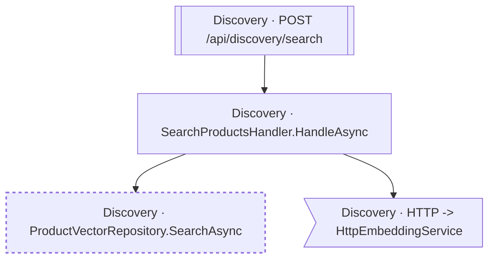

<!-- ÜRETİLMİŞ DOSYA — elle düzenlemeyin. `flowlens docs` ile yeniden üretilir. -->

# POST /api/discovery/search

**Modül:** Discovery · **Tanım:** `src/Modules/Discovery/ModularCommerce.Discovery.Api/Endpoints/SearchEndpoints.cs:17`

## Diyagram neyi göstermiyor

Gösterilen **4** node; ham yürüyüş **15** node'a ulaşıyor. Gizlenen: 6 ara çağrı, 4 utility, 1 arayüz bildirimi, 0 veriye ulaşmayan dal.

Tam liste: `flowlens trace "POST /api/discovery/search"`

## Bilinen sınırlar

- **raw-sql** — Bu akis ham SQL kullaniyor; o erisimin tablosu bu listede YOK. `raw SQL reaches the database outside the model, so no table edge: dataSource.CreateCommand at src/Modules/Discovery/ModularCommerce.Discovery.Infrastructure/Persistence/ProductVectorRepository.cs:26`, `raw SQL reaches the database outside the model, so no table edge: dataSource.CreateCommand at src/Modules/Discovery/ModularCommerce.Discovery.Infrastructure/Persistence/ProductVectorRepository.cs:40`, `raw SQL reaches the database outside the model, so no table edge: dataSource.CreateCommand at src/Modules/Discovery/ModularCommerce.Discovery.Infrastructure/Persistence/ProductVectorRepository.cs:60`
- **ambiguous-implementation** — Bir interface cagrisi birden fazla implementasyona aciliyor. Graph HANGISININ kostugunu KAYDETMIYOR: dekorator zinciri ve koleksiyon enjeksiyonunda hepsi kosar (dogru cevap), config anahtariyla secilende yalniz biri kosar (asiri-yaklasim). Olculen bedel: veri katmaninda 0 tablo/0 kolon, ExternalCall'da 1/1 yanlis pozitif. `src/Modules/Discovery/ModularCommerce.Discovery.Infrastructure/Embedding/FakeEmbeddingService.cs:17`, `src/Modules/Discovery/ModularCommerce.Discovery.Infrastructure/Embedding/HttpEmbeddingService.cs:29`

> Diyagram dar görünüyorsa tıklayarak büyütebilir veya
> [mermaid.live'da açabilirsiniz](https://mermaid.live/edit#pako:eAEBxAE7_nsiY29kZSI6ImZsb3djaGFydCBURFxuICBuMFtcIkRpc2NvdmVyeSDCtyBTZWFyY2hQcm9kdWN0c0hhbmRsZXIuSGFuZGxlQXN5bmNcIl1cbiAgbjFbXCJEaXNjb3ZlcnkgwrcgUHJvZHVjdFZlY3RvclJlcG9zaXRvcnkuU2VhcmNoQXN5bmNcIl1cbiAgbjJbW1wiRGlzY292ZXJ5IMK3IFBPU1QgL2FwaS9kaXNjb3Zlcnkvc2VhcmNoXCJdXVxuICBuMz5cIkRpc2NvdmVyeSDCtyBIVFRQIC0mZ3Q7IEh0dHBFbWJlZGRpbmdTZXJ2aWNlXCJdXG5cbiAgbjAgLS0-IG4xXG4gIG4wIC0tPiBuM1xuICBuMiAtLT4gbjBcblxuICBjbGFzc0RlZiB1bnNlZW4gc3Ryb2tlLWRhc2hhcnJheTogNCA0LHN0cm9rZS13aWR0aDoycHhcbiAgY2xhc3MgbjEgdW5zZWVuXG4iLCJtZXJtYWlkIjoie1xuICBcInRoZW1lXCI6IFwiZGVmYXVsdFwiXG59IiwiYXV0b1N5bmMiOnRydWUsInVwZGF0ZURpYWdyYW0iOnRydWV9roSdTw).
