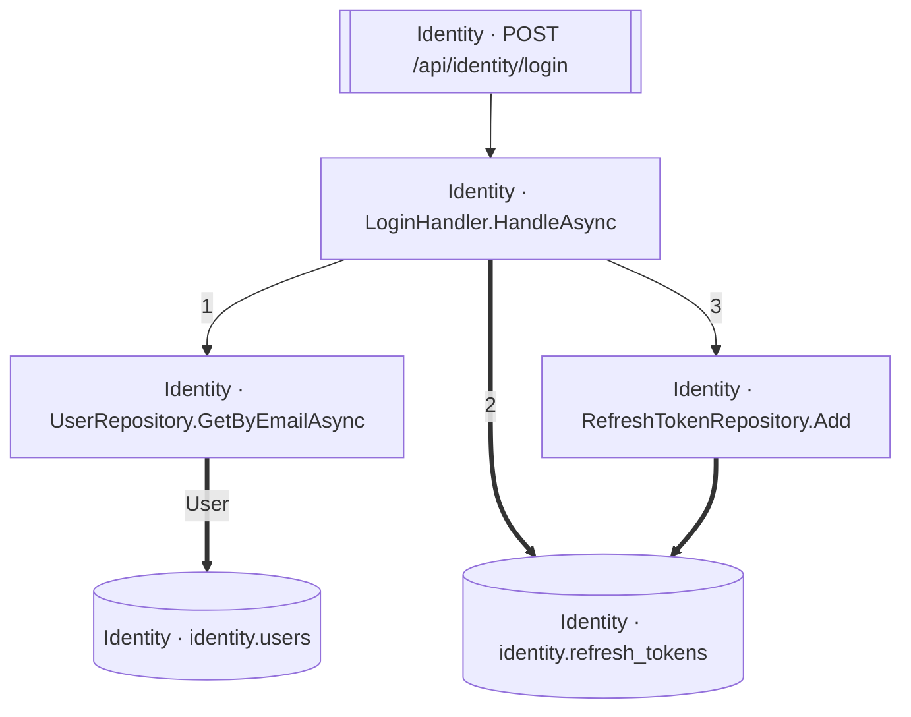

<!-- ÜRETİLMİŞ DOSYA — elle düzenlemeyin. `flowlens docs` ile yeniden üretilir. -->

# POST /api/identity/login

**Modül:** Identity · **Tanım:** `src/Modules/Identity/ModularCommerce.Identity.Api/Endpoints/AuthEndpoints.cs:33`

> **Numaralar kaynak kodda yazılma sırasıdır**, çalışma sırası değil —
> koşullu dallar, döngüler ve erken `return`'ler ikisini ayırır.
> **`koşullu` işaretli adımlar hiç koşmayabilir**, ve bir `if`/ternary'nin iki
> dalındaki adımlar birbirini dışlar — ikisi birden koşmaz.
> Aynı numarayı taşıyan kutular **tek bir çağrıdan** gelir.

## Çağrı sırası

**LoginHandler.HandleAsync** — `src/Modules/Identity/ModularCommerce.Identity.Application/Auth/Login/LoginHandler.cs:16`

1. `LoginHandler.cs:34` → `UserRepository.GetByEmailAsync`
2. `LoginHandler.cs:49` → `identity.refresh_tokens`
3. `LoginHandler.cs:56` → `RefreshTokenRepository.Add`

## Veri katmanı

| Tablo | Erişim | Kolonlar | Tanım |
|---|---|---|---|
| `identity.refresh_tokens` | W | `CreatedAtUtc`, `ExpiresAtUtc`, `Id`, `RevokedAtUtc`, `TokenHash`, `UserId` | `src/Modules/Identity/ModularCommerce.Identity.Infrastructure/Persistence/Configurations/RefreshTokenConfiguration.cs:11` |
| `identity.users` | R | — | `src/Modules/Identity/ModularCommerce.Identity.Infrastructure/Persistence/Configurations/UserConfiguration.cs:11` |

## Diyagram neyi göstermiyor

Gösterilen **6** node; ham yürüyüş **32** node'a ulaşıyor. Gizlenen: 18 ara çağrı, 4 utility, 3 arayüz bildirimi, 1 veriye ulaşmayan dal.

Tam liste: `flowlens trace "POST /api/identity/login"`

## Bilinen sınırlar

- **second-class-evidence** — Bazi yazma iddialari dolayli kanita dayaniyor: entity insasi ya da parametreli bir SaveChanges. Dogru olabilir, ama dogrudan okunmus degil. `new RefreshToken(...) at src/Modules/Identity/ModularCommerce.Identity.Domain/Users/RefreshToken.cs:42`

> Diyagram dar görünüyorsa tıklayarak büyütebilir veya
> [mermaid.live'da açabilirsiniz](https://mermaid.live/edit#pako:eAEB-wEE_nsiY29kZSI6ImZsb3djaGFydCBURFxuICBuMFtcIklkZW50aXR5IMK3IExvZ2luSGFuZGxlci5IYW5kbGVBc3luY1wiXVxuICBuMVtcIklkZW50aXR5IMK3IFJlZnJlc2hUb2tlblJlcG9zaXRvcnkuQWRkXCJdXG4gIG4yW1wiSWRlbnRpdHkgwrcgVXNlclJlcG9zaXRvcnkuR2V0QnlFbWFpbEFzeW5jXCJdXG4gIG4zW1tcIklkZW50aXR5IMK3IFBPU1QgL2FwaS9pZGVudGl0eS9sb2dpblwiXV1cbiAgbjRbKFwiSWRlbnRpdHkgwrcgaWRlbnRpdHkucmVmcmVzaF90b2tlbnNcIildXG4gIG41WyhcIklkZW50aXR5IMK3IGlkZW50aXR5LnVzZXJzXCIpXVxuXG4gIG4wIC0tPnxcIjFcInwgbjJcbiAgbjAgPT0-fFwiMlwifCBuNFxuICBuMCAtLT58XCIzXCJ8IG4xXG4gIG4xID09PiBuNFxuICBuMiA9PT58XCJVc2VyXCJ8IG41XG4gIG4zIC0tPiBuMFxuIiwibWVybWFpZCI6IntcbiAgXCJ0aGVtZVwiOiBcImRlZmF1bHRcIlxufSIsImF1dG9TeW5jIjp0cnVlLCJ1cGRhdGVEaWFncmFtIjp0cnVlfUpArLs).
