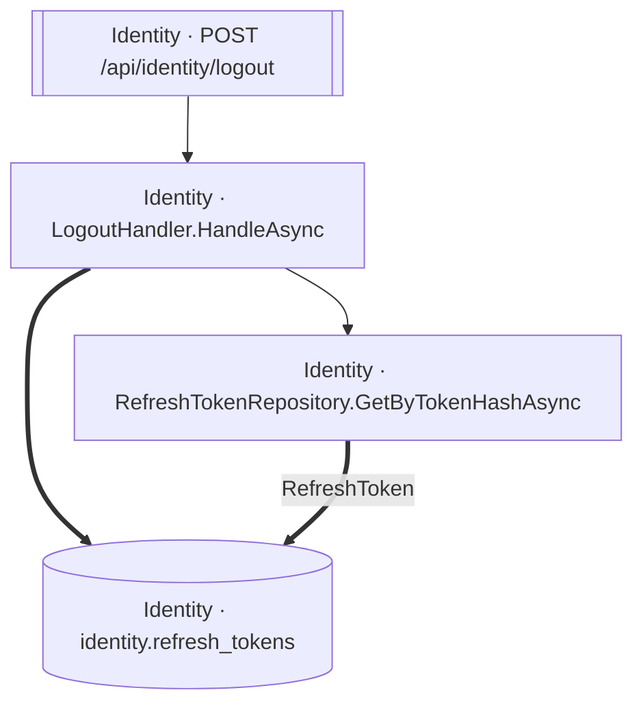

<!-- ÜRETİLMİŞ DOSYA — elle düzenlemeyin. `flowlens docs` ile yeniden üretilir. -->

# POST /api/identity/logout

**Modül:** Identity · **Tanım:** `src/Modules/Identity/ModularCommerce.Identity.Api/Endpoints/AuthEndpoints.cs:52`

## Veri katmanı

| Tablo | Erişim | Kolonlar | Tanım |
|---|---|---|---|
| `identity.refresh_tokens` | WR | `RevokedAtUtc` | `src/Modules/Identity/ModularCommerce.Identity.Infrastructure/Persistence/Configurations/RefreshTokenConfiguration.cs:11` |

## Diyagram neyi göstermiyor

Gösterilen **4** node; ham yürüyüş **17** node'a ulaşıyor. Gizlenen: 5 ara çağrı, 5 utility, 2 arayüz bildirimi, 1 veriye ulaşmayan dal.

Tam liste: `flowlens trace "POST /api/identity/logout"`

## Bilinen sınırlar

Bu sayfa için kaydedilmiş bir sınır yok.

> Diyagram dar görünüyorsa tıklayarak büyütebilir veya
> [mermaid.live'da açabilirsiniz](https://mermaid.live/edit#pako:eAEBiAF3_nsiY29kZSI6ImZsb3djaGFydCBURFxuICBuMFtcIklkZW50aXR5IMK3IExvZ291dEhhbmRsZXIuSGFuZGxlQXN5bmNcIl1cbiAgbjFbXCJJZGVudGl0eSDCtyBSZWZyZXNoVG9rZW5SZXBvc2l0b3J5LkdldEJ5VG9rZW5IYXNoQXN5bmNcIl1cbiAgbjJbW1wiSWRlbnRpdHkgwrcgUE9TVCAvYXBpL2lkZW50aXR5L2xvZ291dFwiXV1cbiAgbjNbKFwiSWRlbnRpdHkgwrcgaWRlbnRpdHkucmVmcmVzaF90b2tlbnNcIildXG5cbiAgbjAgLS0-IG4xXG4gIG4wID09PiBuM1xuICBuMSA9PT58XCJSZWZyZXNoVG9rZW5cInwgbjNcbiAgbjIgLS0-IG4wXG4iLCJtZXJtYWlkIjoie1xuICBcInRoZW1lXCI6IFwiZGVmYXVsdFwiXG59IiwiYXV0b1N5bmMiOnRydWUsInVwZGF0ZURpYWdyYW0iOnRydWV9v_OHuQ).
