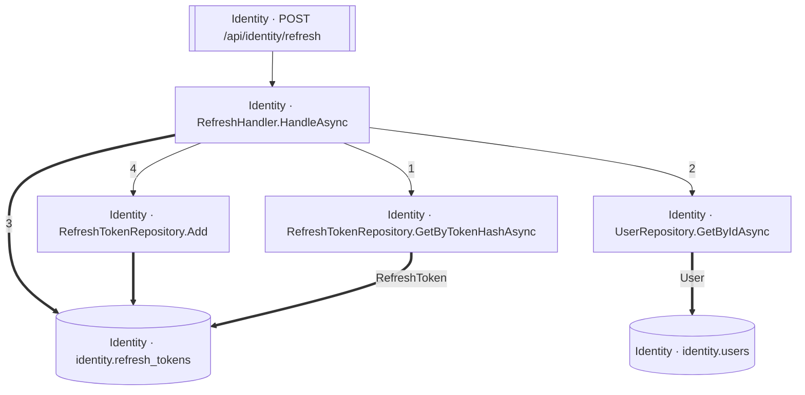

<!-- ÜRETİLMİŞ DOSYA — elle düzenlemeyin. `flowlens docs` ile yeniden üretilir. -->

# POST /api/identity/refresh

**Modül:** Identity · **Tanım:** `src/Modules/Identity/ModularCommerce.Identity.Api/Endpoints/AuthEndpoints.cs:42`

> **Numaralar kaynak kodda yazılma sırasıdır**, çalışma sırası değil —
> koşullu dallar, döngüler ve erken `return`'ler ikisini ayırır.
> **`koşullu` işaretli adımlar hiç koşmayabilir**, ve bir `if`/ternary'nin iki
> dalındaki adımlar birbirini dışlar — ikisi birden koşmaz.
> Aynı numarayı taşıyan kutular **tek bir çağrıdan** gelir.

## Çağrı sırası

**RefreshHandler.HandleAsync** — `src/Modules/Identity/ModularCommerce.Identity.Application/Auth/Refresh/RefreshHandler.cs:15`

1. `RefreshHandler.cs:30` → `RefreshTokenRepository.GetByTokenHashAsync`
2. `RefreshHandler.cs:37` → `UserRepository.GetByIdAsync`
3. `RefreshHandler.cs:45` → `identity.refresh_tokens`
4. `RefreshHandler.cs:57` → `RefreshTokenRepository.Add`

## Veri katmanı

| Tablo | Erişim | Kolonlar | Tanım |
|---|---|---|---|
| `identity.refresh_tokens` | WR | `CreatedAtUtc`, `ExpiresAtUtc`, `Id`, `RevokedAtUtc`, `TokenHash`, `UserId` | `src/Modules/Identity/ModularCommerce.Identity.Infrastructure/Persistence/Configurations/RefreshTokenConfiguration.cs:11` |
| `identity.users` | R | — | `src/Modules/Identity/ModularCommerce.Identity.Infrastructure/Persistence/Configurations/UserConfiguration.cs:11` |

## Diyagram neyi göstermiyor

Gösterilen **7** node; ham yürüyüş **34** node'a ulaşıyor. Gizlenen: 17 ara çağrı, 5 utility, 4 arayüz bildirimi, 1 veriye ulaşmayan dal.

Tam liste: `flowlens trace "POST /api/identity/refresh"`

## Bilinen sınırlar

- **second-class-evidence** — Bazi yazma iddialari dolayli kanita dayaniyor: entity insasi ya da parametreli bir SaveChanges. Dogru olabilir, ama dogrudan okunmus degil. `new RefreshToken(...) at src/Modules/Identity/ModularCommerce.Identity.Domain/Users/RefreshToken.cs:42`

> Diyagram dar görünüyorsa tıklayarak büyütebilir veya
> [mermaid.live'da açabilirsiniz](https://mermaid.live/edit#pako:eAEBcQKO_XsiY29kZSI6ImZsb3djaGFydCBURFxuICBuMFtcIklkZW50aXR5IMK3IFJlZnJlc2hIYW5kbGVyLkhhbmRsZUFzeW5jXCJdXG4gIG4xW1wiSWRlbnRpdHkgwrcgUmVmcmVzaFRva2VuUmVwb3NpdG9yeS5BZGRcIl1cbiAgbjJbXCJJZGVudGl0eSDCtyBSZWZyZXNoVG9rZW5SZXBvc2l0b3J5LkdldEJ5VG9rZW5IYXNoQXN5bmNcIl1cbiAgbjNbXCJJZGVudGl0eSDCtyBVc2VyUmVwb3NpdG9yeS5HZXRCeUlkQXN5bmNcIl1cbiAgbjRbW1wiSWRlbnRpdHkgwrcgUE9TVCAvYXBpL2lkZW50aXR5L3JlZnJlc2hcIl1dXG4gIG41WyhcIklkZW50aXR5IMK3IGlkZW50aXR5LnJlZnJlc2hfdG9rZW5zXCIpXVxuICBuNlsoXCJJZGVudGl0eSDCtyBpZGVudGl0eS51c2Vyc1wiKV1cblxuICBuMCAtLT58XCIxXCJ8IG4yXG4gIG4wIC0tPnxcIjJcInwgbjNcbiAgbjAgPT0-fFwiM1wifCBuNVxuICBuMCAtLT58XCI0XCJ8IG4xXG4gIG4xID09PiBuNVxuICBuMiA9PT58XCJSZWZyZXNoVG9rZW5cInwgbjVcbiAgbjMgPT0-fFwiVXNlclwifCBuNlxuICBuNCAtLT4gbjBcbiIsIm1lcm1haWQiOiJ7XG4gIFwidGhlbWVcIjogXCJkZWZhdWx0XCJcbn0iLCJhdXRvU3luYyI6dHJ1ZSwidXBkYXRlRGlhZ3JhbSI6dHJ1ZX0BwNWE).
