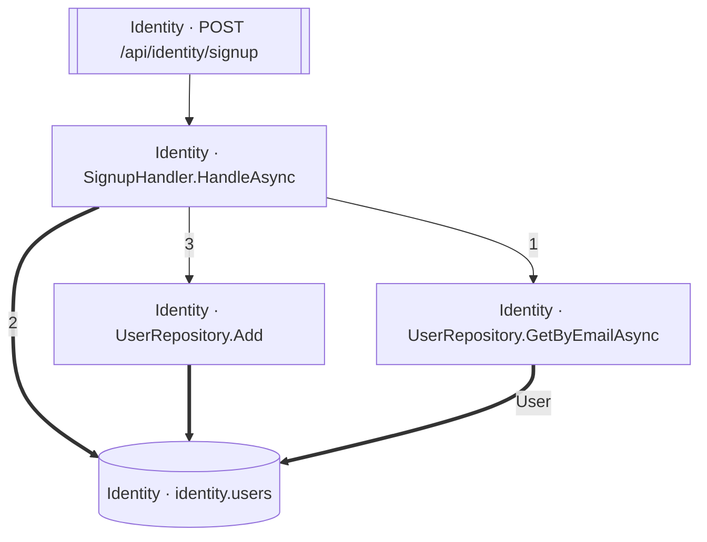

<!-- ÜRETİLMİŞ DOSYA — elle düzenlemeyin. `flowlens docs` ile yeniden üretilir. -->

# POST /api/identity/signup

**Modül:** Identity · **Tanım:** `src/Modules/Identity/ModularCommerce.Identity.Api/Endpoints/AuthEndpoints.cs:20`

> **Numaralar kaynak kodda yazılma sırasıdır**, çalışma sırası değil —
> koşullu dallar, döngüler ve erken `return`'ler ikisini ayırır.
> **`koşullu` işaretli adımlar hiç koşmayabilir**, ve bir `if`/ternary'nin iki
> dalındaki adımlar birbirini dışlar — ikisi birden koşmaz.
> Aynı numarayı taşıyan kutular **tek bir çağrıdan** gelir.

## Çağrı sırası

**SignupHandler.HandleAsync** — `src/Modules/Identity/ModularCommerce.Identity.Application/Auth/Signup/SignupHandler.cs:13`

1. `SignupHandler.cs:31` → `UserRepository.GetByEmailAsync`
2. `SignupHandler.cs:37` → `identity.users`
3. `SignupHandler.cs:43` → `UserRepository.Add`

## Veri katmanı

| Tablo | Erişim | Kolonlar | Tanım |
|---|---|---|---|
| `identity.users` | WR | `CreatedAtUtc`, `Id`, `PasswordHash`, `email` | `src/Modules/Identity/ModularCommerce.Identity.Infrastructure/Persistence/Configurations/UserConfiguration.cs:11` |

## Diyagram neyi göstermiyor

Gösterilen **5** node; ham yürüyüş **26** node'a ulaşıyor. Gizlenen: 10 ara çağrı, 7 utility, 3 arayüz bildirimi, 1 veriye ulaşmayan dal.

Tam liste: `flowlens trace "POST /api/identity/signup"`

## Bilinen sınırlar

- **second-class-evidence** — Bazi yazma iddialari dolayli kanita dayaniyor: entity insasi ya da parametreli bir SaveChanges. Dogru olabilir, ama dogrudan okunmus degil. `new User(...) at src/Modules/Identity/ModularCommerce.Identity.Domain/Users/User.cs:29`

> Diyagram dar görünüyorsa tıklayarak büyütebilir veya
> [mermaid.live'da açabilirsiniz](https://mermaid.live/edit#pako:eAEBxAE7_nsiY29kZSI6ImZsb3djaGFydCBURFxuICBuMFtcIklkZW50aXR5IMK3IFNpZ251cEhhbmRsZXIuSGFuZGxlQXN5bmNcIl1cbiAgbjFbXCJJZGVudGl0eSDCtyBVc2VyUmVwb3NpdG9yeS5BZGRcIl1cbiAgbjJbXCJJZGVudGl0eSDCtyBVc2VyUmVwb3NpdG9yeS5HZXRCeUVtYWlsQXN5bmNcIl1cbiAgbjNbW1wiSWRlbnRpdHkgwrcgUE9TVCAvYXBpL2lkZW50aXR5L3NpZ251cFwiXV1cbiAgbjRbKFwiSWRlbnRpdHkgwrcgaWRlbnRpdHkudXNlcnNcIildXG5cbiAgbjAgLS0-fFwiMVwifCBuMlxuICBuMCA9PT58XCIyXCJ8IG40XG4gIG4wIC0tPnxcIjNcInwgbjFcbiAgbjEgPT0-IG40XG4gIG4yID09PnxcIlVzZXJcInwgbjRcbiAgbjMgLS0-IG4wXG4iLCJtZXJtYWlkIjoie1xuICBcInRoZW1lXCI6IFwiZGVmYXVsdFwiXG59IiwiYXV0b1N5bmMiOnRydWUsInVwZGF0ZURpYWdyYW0iOnRydWV9VU2YVA).
