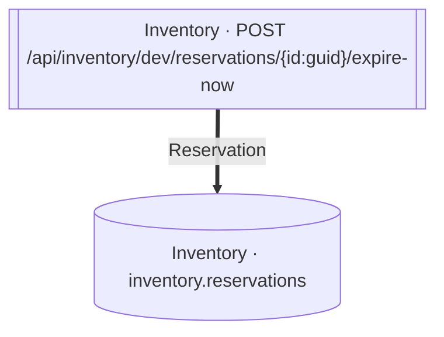

<!-- ÜRETİLMİŞ DOSYA — elle düzenlemeyin. `flowlens docs` ile yeniden üretilir. -->

# POST /api/inventory/dev/reservations/{id:guid}/expire-now

**Modül:** Inventory · **Tanım:** `src/Modules/Inventory/ModularCommerce.Inventory.Api/Endpoints/StockEndpoints.cs:46`

## Veri katmanı

| Tablo | Erişim | Kolonlar | Tanım |
|---|---|---|---|
| `inventory.reservations` | W | — | `src/Modules/Inventory/ModularCommerce.Inventory.Infrastructure/Persistence/Configurations/ReservationConfiguration.cs:11` |

## Diyagram neyi göstermiyor

Gösterilen **2** node; ham yürüyüş **3** node'a ulaşıyor. Gizlenen: 1 ara çağrı, 0 utility, 0 arayüz bildirimi, 0 veriye ulaşmayan dal.

Tam liste: `flowlens trace "POST /api/inventory/dev/reservations/{id:guid}/expire-now"`

## Bilinen sınırlar

Bu sayfa için kaydedilmiş bir sınır yok.

> Diyagram dar görünüyorsa tıklayarak büyütebilir veya
> [mermaid.live'da açabilirsiniz](https://mermaid.live/edit#pako:eAEBDgHx_nsiY29kZSI6ImZsb3djaGFydCBURFxuICBuMFtbXCJJbnZlbnRvcnkgwrcgUE9TVCAvYXBpL2ludmVudG9yeS9kZXYvcmVzZXJ2YXRpb25zL3tpZDpndWlkfS9leHBpcmUtbm93XCJdXVxuICBuMVsoXCJJbnZlbnRvcnkgwrcgaW52ZW50b3J5LnJlc2VydmF0aW9uc1wiKV1cblxuICBuMCA9PT58XCJSZXNlcnZhdGlvblwifCBuMVxuIiwibWVybWFpZCI6IntcbiAgXCJ0aGVtZVwiOiBcImRlZmF1bHRcIlxufSIsImF1dG9TeW5jIjp0cnVlLCJ1cGRhdGVEaWFncmFtIjp0cnVlfXFtYEk).
