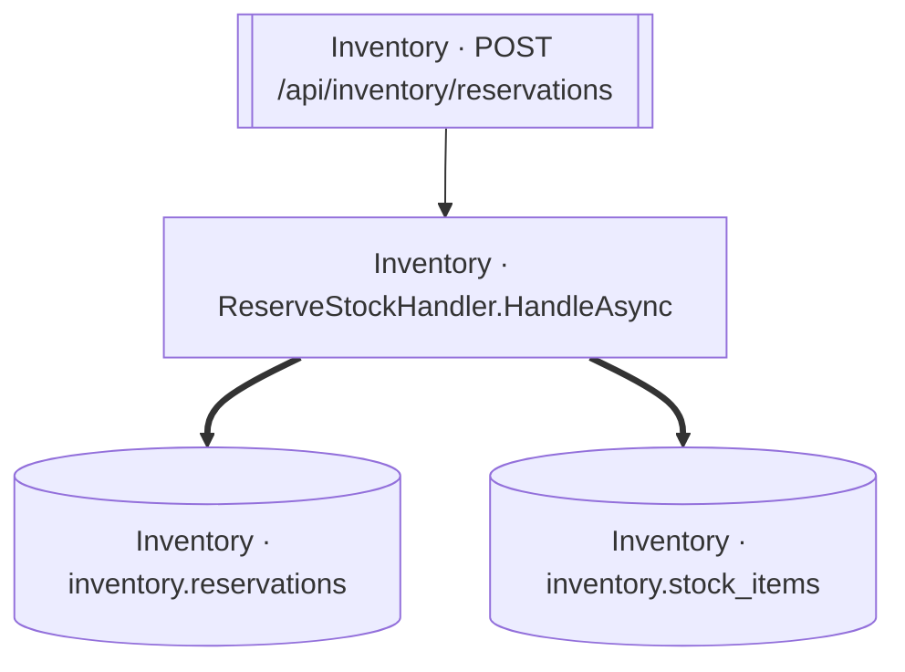

<!-- ÜRETİLMİŞ DOSYA — elle düzenlemeyin. `flowlens docs` ile yeniden üretilir. -->

# POST /api/inventory/reservations

**Modül:** Inventory · **Tanım:** `src/Modules/Inventory/ModularCommerce.Inventory.Api/Endpoints/ReservationEndpoints.cs:14`

## Veri katmanı

| Tablo | Erişim | Kolonlar | Tanım |
|---|---|---|---|
| `inventory.reservations` | W | `CreatedAtUtc`, `ExpiresAtUtc`, `Id`, `ProductId`, `Quantity`, `Status`, `StockItemId` | `src/Modules/Inventory/ModularCommerce.Inventory.Infrastructure/Persistence/Configurations/ReservationConfiguration.cs:11` |
| `inventory.stock_items` | WR | `Reserved`, `UpdatedAtUtc` | `src/Modules/Inventory/ModularCommerce.Inventory.Infrastructure/Persistence/Configurations/StockItemConfiguration.cs:11` |

## Diyagram neyi göstermiyor

Gösterilen **4** node; ham yürüyüş **30** node'a ulaşıyor. Gizlenen: 20 ara çağrı, 6 utility, 0 arayüz bildirimi, 0 veriye ulaşmayan dal.

Tam liste: `flowlens trace "POST /api/inventory/reservations"`

## Bilinen sınırlar

- **raw-sql** — Bu akis ham SQL kullaniyor; o erisimin tablosu bu listede YOK. `raw SQL reaches the database outside the model, so no table edge: context.Database.ExecuteSqlAsync at src/Modules/Inventory/ModularCommerce.Inventory.Infrastructure/Persistence/Strategies/NaiveReservationStrategy.cs:37`
- **second-class-evidence** — Bazi yazma iddialari dolayli kanita dayaniyor: entity insasi ya da parametreli bir SaveChanges. Dogru olabilir, ama dogrudan okunmus degil. `SaveChanges at src/Modules/Inventory/ModularCommerce.Inventory.Infrastructure/Persistence/Strategies/NaiveReservationStrategy.cs:46 with a tracked StockItem`, `SaveChanges at src/Modules/Inventory/ModularCommerce.Inventory.Infrastructure/Persistence/Strategies/OptimisticConcurrencyReservationStrategy.cs:34 with a tracked StockItem`, `SaveChanges at src/Modules/Inventory/ModularCommerce.Inventory.Infrastructure/Persistence/Strategies/RedisLockReservationStrategy.cs:69 with a tracked StockItem`, `new Reservation(...) at src/Modules/Inventory/ModularCommerce.Inventory.Domain/Stock/Reservation.cs:34`
- **ambiguous-implementation** — Bir interface cagrisi birden fazla implementasyona aciliyor. Graph HANGISININ kostugunu KAYDETMIYOR: dekorator zinciri ve koleksiyon enjeksiyonunda hepsi kosar (dogru cevap), config anahtariyla secilende yalniz biri kosar (asiri-yaklasim). Olculen bedel: veri katmaninda 0 tablo/0 kolon, ExternalCall'da 1/1 yanlis pozitif. `src/Modules/Inventory/ModularCommerce.Inventory.Infrastructure/Persistence/Strategies/NaiveReservationStrategy.cs:10`, `src/Modules/Inventory/ModularCommerce.Inventory.Infrastructure/Persistence/Strategies/OptimisticConcurrencyReservationStrategy.cs:11`, `src/Modules/Inventory/ModularCommerce.Inventory.Infrastructure/Persistence/Strategies/RedisLockReservationStrategy.cs:17`

> Diyagram dar görünüyorsa tıklayarak büyütebilir veya
> [mermaid.live'da açabilirsiniz](https://mermaid.live/edit#pako:eAEBZgGZ_nsiY29kZSI6ImZsb3djaGFydCBURFxuICBuMFtcIkludmVudG9yeSDCtyBSZXNlcnZlU3RvY2tIYW5kbGVyLkhhbmRsZUFzeW5jXCJdXG4gIG4xW1tcIkludmVudG9yeSDCtyBQT1NUIC9hcGkvaW52ZW50b3J5L3Jlc2VydmF0aW9uc1wiXV1cbiAgbjJbKFwiSW52ZW50b3J5IMK3IGludmVudG9yeS5yZXNlcnZhdGlvbnNcIildXG4gIG4zWyhcIkludmVudG9yeSDCtyBpbnZlbnRvcnkuc3RvY2tfaXRlbXNcIildXG5cbiAgbjAgPT0-IG4yXG4gIG4wID09PiBuM1xuICBuMSAtLT4gbjBcbiIsIm1lcm1haWQiOiJ7XG4gIFwidGhlbWVcIjogXCJkZWZhdWx0XCJcbn0iLCJhdXRvU3luYyI6dHJ1ZSwidXBkYXRlRGlhZ3JhbSI6dHJ1ZX0fJn2V).
