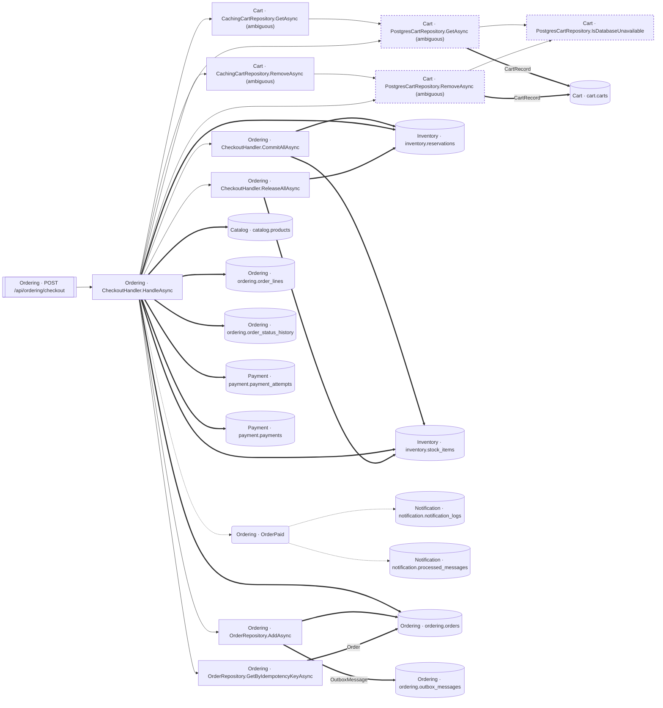

<!-- ÜRETİLMİŞ DOSYA — elle düzenlemeyin. `flowlens docs` ile yeniden üretilir. -->

# POST /api/ordering/checkout

**Modül:** Ordering · **Tanım:** `src/Modules/Ordering/ModularCommerce.Ordering.Api/Endpoints/OrderEndpoints.cs:22`

## Veri katmanı

| Tablo | Erişim | Kolonlar | Tanım |
|---|---|---|---|
| `cart.carts` | WR | — | `src/Modules/Cart/ModularCommerce.Cart.Infrastructure/Persistence/Configurations/CartConfiguration.cs:10` |
| `catalog.products` | R | — | `src/Modules/Catalog/ModularCommerce.Catalog.Infrastructure/Persistence/Configurations/ProductConfiguration.cs:11` |
| `inventory.reservations` | WR | `CreatedAtUtc`, `ExpiresAtUtc`, `Id`, `ProductId`, `Quantity`, `Status`, `StockItemId` | `src/Modules/Inventory/ModularCommerce.Inventory.Infrastructure/Persistence/Configurations/ReservationConfiguration.cs:11` |
| `inventory.stock_items` | WR | `OnHand`, `Reserved`, `UpdatedAtUtc` | `src/Modules/Inventory/ModularCommerce.Inventory.Infrastructure/Persistence/Configurations/StockItemConfiguration.cs:11` |
| `notification.notification_logs` | W | `Channel`, `Id`, `IdempotencyKey`, `OrderId`, `Recipient`, `SentAtUtc`, `Subject` | `src/Modules/Notification/ModularCommerce.Notification.Infrastructure/Persistence/Configurations/NotificationLogConfiguration.cs:11` |
| `notification.processed_messages` | WR | `ConsumerType`, `IdempotencyKey`, `MessageId`, `ProcessedOnUtc` | `src/Modules/Notification/ModularCommerce.Notification.Infrastructure/Persistence/Configurations/ProcessedMessageConfiguration.cs:14` |
| `ordering.order_lines` | W | `ProductId`, `ProductName`, `Quantity`, `ReservationId`, `id`, `order_id` | `src/Modules/Ordering/ModularCommerce.Ordering.Infrastructure/Persistence/Configurations/OrderConfiguration.cs:31` |
| `ordering.order_status_history` | W | `FromStatus`, `OccurredAtUtc`, `ToStatus`, `TriggeredBy`, `id`, `order_id` | `src/Modules/Ordering/ModularCommerce.Ordering.Infrastructure/Persistence/Configurations/OrderConfiguration.cs:54` |
| `ordering.orders` | WR | `CreatedAtUtc`, `CustomerId`, `Id`, `IdempotencyKey`, `Status`, `UpdatedAtUtc` | `src/Modules/Ordering/ModularCommerce.Ordering.Infrastructure/Persistence/Configurations/OrderConfiguration.cs:13` |
| `ordering.outbox_messages` | W | — | `src/Modules/Ordering/ModularCommerce.Ordering.Infrastructure/Outbox/OutboxMessageConfiguration.cs:10` |
| `payment.payment_attempts` | W | `AttemptNumber`, `ErrorCode`, `LatencyMs`, `OccurredAtUtc`, `Outcome`, `PspTransactionId`, `id`, `payment_id` | `src/Modules/Payment/ModularCommerce.Payment.Infrastructure/Persistence/Configurations/PaymentConfiguration.cs:56` |
| `payment.payments` | WR | `Amount`, `ClaimedAtUtc`, `CompletedAtUtc`, `CreatedAtUtc`, `Currency`, `CustomerId`, `FailureCode`, `Id`, `IdempotencyKey`, `Method`, `OrderId`, `PspTransactionId`, `RefundTransactionId`, `RefundedAtUtc`, `Status` | `src/Modules/Payment/ModularCommerce.Payment.Infrastructure/Persistence/Configurations/PaymentConfiguration.cs:14` |

## Diyagram neyi göstermiyor

Gösterilen **24** node; ham yürüyüş **192** node'a ulaşıyor. Gizlenen: 152 ara çağrı, 11 utility, 4 arayüz bildirimi, 1 veriye ulaşmayan dal.

Tam liste: `flowlens trace "POST /api/ordering/checkout"`

## Bilinen sınırlar

- **raw-sql** — Bu akis ham SQL kullaniyor; o erisimin tablosu bu listede YOK. `raw SQL reaches the database outside the model, so no table edge: context.Database.ExecuteSqlAsync at src/Modules/Inventory/ModularCommerce.Inventory.Infrastructure/Persistence/Strategies/NaiveReservationStrategy.cs:37`
- **unmapped-column** — Yazilan bir property'nin kolonu yok (Ignore edilmis, hesaplanan ya da JSON alani). `property written but not mapped to a column: CartItemRecord.AddedAtUtc at src/Modules/Cart/ModularCommerce.Cart.Infrastructure/Persistence/PostgresCartRepository.cs:41 (no column)`, `property written but not mapped to a column: CartItemRecord.ProductId at src/Modules/Cart/ModularCommerce.Cart.Infrastructure/Persistence/PostgresCartRepository.cs:41 (no column)`, `property written but not mapped to a column: CartItemRecord.Quantity at src/Modules/Cart/ModularCommerce.Cart.Infrastructure/Persistence/PostgresCartRepository.cs:41 (no column)`
- **second-class-evidence** — Bazi yazma iddialari dolayli kanita dayaniyor: entity insasi ya da parametreli bir SaveChanges. Dogru olabilir, ama dogrudan okunmus degil. `SaveChanges at src/Modules/Inventory/ModularCommerce.Inventory.Infrastructure/ContractAdapters/StockReservationService.cs:102 with a tracked Reservation`, `SaveChanges at src/Modules/Inventory/ModularCommerce.Inventory.Infrastructure/ContractAdapters/StockReservationService.cs:102 with a tracked StockItem`, `SaveChanges at src/Modules/Inventory/ModularCommerce.Inventory.Infrastructure/Persistence/Strategies/NaiveReservationStrategy.cs:46 with a tracked StockItem`, `SaveChanges at src/Modules/Inventory/ModularCommerce.Inventory.Infrastructure/Persistence/Strategies/OptimisticConcurrencyReservationStrategy.cs:34 with a tracked StockItem`, `SaveChanges at src/Modules/Inventory/ModularCommerce.Inventory.Infrastructure/Persistence/Strategies/RedisLockReservationStrategy.cs:69 with a tracked StockItem`, `SaveChanges at src/Modules/Payment/ModularCommerce.Payment.Infrastructure/ContractAdapters/PaymentService.cs:192 with a tracked Payment`, `new NotificationLog(...) at src/Modules/Notification/ModularCommerce.Notification.Infrastructure/NotificationProcessor.cs:42`, `new Order(...) at src/Modules/Ordering/ModularCommerce.Ordering.Domain/Orders/Order.cs:116`, `new OrderLine(...) at src/Modules/Ordering/ModularCommerce.Ordering.Domain/Orders/Order.cs:107`, `new OrderStatusChange(...) at src/Modules/Ordering/ModularCommerce.Ordering.Domain/Orders/Order.cs:119`, `new OrderStatusChange(...) at src/Modules/Ordering/ModularCommerce.Ordering.Domain/Orders/Order.cs:169`, `new Payment(...) at src/Modules/Payment/ModularCommerce.Payment.Domain/Payments/Payment.cs:81`, `new PaymentAttempt(...) at src/Modules/Payment/ModularCommerce.Payment.Domain/Payments/Payment.cs:116`, `new ProcessedMessage(...) at src/Modules/Notification/ModularCommerce.Notification.Infrastructure/NotificationProcessor.cs:53`, `new Reservation(...) at src/Modules/Inventory/ModularCommerce.Inventory.Domain/Stock/Reservation.cs:34`
- **ambiguous-implementation** — Bir interface cagrisi birden fazla implementasyona aciliyor. Graph HANGISININ kostugunu KAYDETMIYOR: dekorator zinciri ve koleksiyon enjeksiyonunda hepsi kosar (dogru cevap), config anahtariyla secilende yalniz biri kosar (asiri-yaklasim). Olculen bedel: veri katmaninda 0 tablo/0 kolon, ExternalCall'da 1/1 yanlis pozitif. `src/Modules/Cart/ModularCommerce.Cart.Infrastructure/Persistence/CachingCartRepository.cs:38`, `src/Modules/Cart/ModularCommerce.Cart.Infrastructure/Persistence/CachingCartRepository.cs:9`, `src/Modules/Cart/ModularCommerce.Cart.Infrastructure/Persistence/PostgresCartRepository.cs:10`, `src/Modules/Cart/ModularCommerce.Cart.Infrastructure/Persistence/PostgresCartRepository.cs:71`, `src/Modules/Catalog/ModularCommerce.Catalog.Infrastructure/Caching/CachingProductReader.cs:13`, `src/Modules/Catalog/ModularCommerce.Catalog.Infrastructure/Persistence/Queries/ProductReader.cs:7`, `src/Modules/Inventory/ModularCommerce.Inventory.Infrastructure/Persistence/Strategies/NaiveReservationStrategy.cs:10`, `src/Modules/Inventory/ModularCommerce.Inventory.Infrastructure/Persistence/Strategies/OptimisticConcurrencyReservationStrategy.cs:11`, `src/Modules/Inventory/ModularCommerce.Inventory.Infrastructure/Persistence/Strategies/RedisLockReservationStrategy.cs:17`, `src/Modules/Notification/ModularCommerce.Notification.Infrastructure/Channels/EmailNotificationChannel.cs:12`, `src/Modules/Notification/ModularCommerce.Notification.Infrastructure/Channels/FaultInjectingChannel.cs:12`, `src/Modules/Notification/ModularCommerce.Notification.Infrastructure/Channels/WebhookNotificationChannel.cs:13`
- **interceptor-columns** — Bir SaveChanges interceptor'inin yazdigi tablolar TABLO duzeyinde dogru, KOLON duzeyinde bos: interceptor'i EF cagirir, kod degil, dolayisiyla govdesindeki atamalar hicbir akisin ulasilabilir kumesinde degil (known-limitations L16-4). `entity:ModularCommerce.Ordering.Infrastructure.Outbox.OutboxMessage`

> Diyagram dar görünüyorsa tıklayarak büyütebilir veya
> [mermaid.live'da açabilirsiniz](https://mermaid.live/edit#pako:eAEBtgdJ-HsiY29kZSI6ImZsb3djaGFydCBMUlxuICBuMFtcIkNhcnQgwrcgQ2FjaGluZ0NhcnRSZXBvc2l0b3J5LkdldEFzeW5jIChhbWJpZ3VvdXMpXCJdXG4gIG4xW1wiQ2FydCDCtyBDYWNoaW5nQ2FydFJlcG9zaXRvcnkuUmVtb3ZlQXN5bmMgKGFtYmlndW91cylcIl1cbiAgbjJbXCJDYXJ0IMK3IFBvc3RncmVzQ2FydFJlcG9zaXRvcnkuR2V0QXN5bmMgKGFtYmlndW91cylcIl1cbiAgbjNbXCJDYXJ0IMK3IFBvc3RncmVzQ2FydFJlcG9zaXRvcnkuSXNEYXRhYmFzZVVuYXZhaWxhYmxlXCJdXG4gIG40W1wiQ2FydCDCtyBQb3N0Z3Jlc0NhcnRSZXBvc2l0b3J5LlJlbW92ZUFzeW5jIChhbWJpZ3VvdXMpXCJdXG4gIG41W1wiT3JkZXJpbmcgwrcgQ2hlY2tvdXRIYW5kbGVyLkNvbW1pdEFsbEFzeW5jXCJdXG4gIG42W1wiT3JkZXJpbmcgwrcgQ2hlY2tvdXRIYW5kbGVyLkhhbmRsZUFzeW5jXCJdXG4gIG43W1wiT3JkZXJpbmcgwrcgQ2hlY2tvdXRIYW5kbGVyLlJlbGVhc2VBbGxBc3luY1wiXVxuICBuOFtcIk9yZGVyaW5nIMK3IE9yZGVyUmVwb3NpdG9yeS5BZGRBc3luY1wiXVxuICBuOVtcIk9yZGVyaW5nIMK3IE9yZGVyUmVwb3NpdG9yeS5HZXRCeUlkZW1wb3RlbmN5S2V5QXN5bmNcIl1cbiAgbjEwW1tcIk9yZGVyaW5nIMK3IFBPU1QgL2FwaS9vcmRlcmluZy9jaGVja291dFwiXV1cbiAgbjExKFwiT3JkZXJpbmcgwrcgT3JkZXJQYWlkXCIpXG4gIG4xMlsoXCJDYXJ0IMK3IGNhcnQuY2FydHNcIildXG4gIG4xM1soXCJDYXRhbG9nIMK3IGNhdGFsb2cucHJvZHVjdHNcIildXG4gIG4xNFsoXCJJbnZlbnRvcnkgwrcgaW52ZW50b3J5LnJlc2VydmF0aW9uc1wiKV1cbiAgbjE1WyhcIkludmVudG9yeSDCtyBpbnZlbnRvcnkuc3RvY2tfaXRlbXNcIildXG4gIG4xNlsoXCJOb3RpZmljYXRpb24gwrcgbm90aWZpY2F0aW9uLm5vdGlmaWNhdGlvbl9sb2dzXCIpXVxuICBuMTdbKFwiTm90aWZpY2F0aW9uIMK3IG5vdGlmaWNhdGlvbi5wcm9jZXNzZWRfbWVzc2FnZXNcIildXG4gIG4xOFsoXCJPcmRlcmluZyDCtyBvcmRlcmluZy5vcmRlcl9saW5lc1wiKV1cbiAgbjE5WyhcIk9yZGVyaW5nIMK3IG9yZGVyaW5nLm9yZGVyX3N0YXR1c19oaXN0b3J5XCIpXVxuICBuMjBbKFwiT3JkZXJpbmcgwrcgb3JkZXJpbmcub3JkZXJzXCIpXVxuICBuMjFbKFwiT3JkZXJpbmcgwrcgb3JkZXJpbmcub3V0Ym94X21lc3NhZ2VzXCIpXVxuICBuMjJbKFwiUGF5bWVudCDCtyBwYXltZW50LnBheW1lbnRfYXR0ZW1wdHNcIildXG4gIG4yM1soXCJQYXltZW50IMK3IHBheW1lbnQucGF5bWVudHNcIildXG5cbiAgbjAgLS0-IG4yXG4gIG4xIC0tPiBuNFxuICBuMiAtLT4gbjNcbiAgbjIgPT0-fFwiQ2FydFJlY29yZFwifCBuMTJcbiAgbjQgLS0-IG4zXG4gIG40ID09PnxcIkNhcnRSZWNvcmRcInwgbjEyXG4gIG41ID09PiBuMTRcbiAgbjUgPT0-IG4xNVxuICBuNiAtLT4gbjBcbiAgbjYgLS0-IG4xXG4gIG42IC0tPiBuMlxuICBuNiAtLT4gbjRcbiAgbjYgLS0-IG41XG4gIG42IC0tPiBuN1xuICBuNiAtLT4gbjhcbiAgbjYgLS0-IG45XG4gIG42IC0uLT4gbjExXG4gIG42ID09PiBuMTNcbiAgbjYgPT0-IG4xNFxuICBuNiA9PT4gbjE1XG4gIG42ID09PiBuMThcbiAgbjYgPT0-IG4xOVxuICBuNiA9PT4gbjIwXG4gIG42ID09PiBuMjJcbiAgbjYgPT0-IG4yM1xuICBuNyA9PT4gbjE0XG4gIG43ID09PiBuMTVcbiAgbjggPT0-IG4yMFxuICBuOCA9PT58XCJPdXRib3hNZXNzYWdlXCJ8IG4yMVxuICBuOSA9PT58XCJPcmRlclwifCBuMjBcbiAgbjEwIC0tPiBuNlxuICBuMTEgLS4tPiBuMTZcbiAgbjExIC0uLT4gbjE3XG5cbiAgY2xhc3NEZWYgdW5zZWVuIHN0cm9rZS1kYXNoYXJyYXk6IDQgNCxzdHJva2Utd2lkdGg6MnB4XG4gIGNsYXNzIG4yLG4zLG40IHVuc2VlblxuIiwibWVybWFpZCI6IntcbiAgXCJ0aGVtZVwiOiBcImRlZmF1bHRcIlxufSIsImF1dG9TeW5jIjp0cnVlLCJ1cGRhdGVEaWFncmFtIjp0cnVlfcXzmLw).
