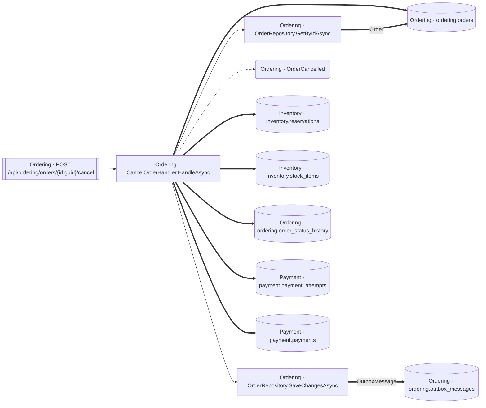

<!-- ÜRETİLMİŞ DOSYA — elle düzenlemeyin. `flowlens docs` ile yeniden üretilir. -->

# POST /api/ordering/orders/{id:guid}/cancel

**Modül:** Ordering · **Tanım:** `src/Modules/Ordering/ModularCommerce.Ordering.Api/Endpoints/OrderEndpoints.cs:61`

## Veri katmanı

| Tablo | Erişim | Kolonlar | Tanım |
|---|---|---|---|
| `inventory.reservations` | WR | `Status` | `src/Modules/Inventory/ModularCommerce.Inventory.Infrastructure/Persistence/Configurations/ReservationConfiguration.cs:11` |
| `inventory.stock_items` | WR | `OnHand`, `UpdatedAtUtc` | `src/Modules/Inventory/ModularCommerce.Inventory.Infrastructure/Persistence/Configurations/StockItemConfiguration.cs:11` |
| `ordering.order_status_history` | W | `FromStatus`, `OccurredAtUtc`, `ToStatus`, `TriggeredBy`, `id`, `order_id` | `src/Modules/Ordering/ModularCommerce.Ordering.Infrastructure/Persistence/Configurations/OrderConfiguration.cs:54` |
| `ordering.orders` | WR | `Status`, `UpdatedAtUtc` | `src/Modules/Ordering/ModularCommerce.Ordering.Infrastructure/Persistence/Configurations/OrderConfiguration.cs:13` |
| `ordering.outbox_messages` | W | — | `src/Modules/Ordering/ModularCommerce.Ordering.Infrastructure/Outbox/OutboxMessageConfiguration.cs:10` |
| `payment.payment_attempts` | W | `AttemptNumber`, `ErrorCode`, `LatencyMs`, `OccurredAtUtc`, `Outcome`, `PspTransactionId`, `id`, `payment_id` | `src/Modules/Payment/ModularCommerce.Payment.Infrastructure/Persistence/Configurations/PaymentConfiguration.cs:56` |
| `payment.payments` | WR | `RefundTransactionId`, `RefundedAtUtc`, `Status` | `src/Modules/Payment/ModularCommerce.Payment.Infrastructure/Persistence/Configurations/PaymentConfiguration.cs:14` |

## Diyagram neyi göstermiyor

Gösterilen **12** node; ham yürüyüş **67** node'a ulaşıyor. Gizlenen: 44 ara çağrı, 9 utility, 2 arayüz bildirimi, 0 veriye ulaşmayan dal.

Tam liste: `flowlens trace "POST /api/ordering/orders/{id:guid}/cancel"`

## Bilinen sınırlar

- **second-class-evidence** — Bazi yazma iddialari dolayli kanita dayaniyor: entity insasi ya da parametreli bir SaveChanges. Dogru olabilir, ama dogrudan okunmus degil. `SaveChanges at src/Modules/Inventory/ModularCommerce.Inventory.Infrastructure/ContractAdapters/StockReservationService.cs:102 with a tracked Reservation`, `SaveChanges at src/Modules/Inventory/ModularCommerce.Inventory.Infrastructure/ContractAdapters/StockReservationService.cs:102 with a tracked StockItem`, `SaveChanges at src/Modules/Payment/ModularCommerce.Payment.Infrastructure/ContractAdapters/PaymentService.cs:236 with a tracked Payment`, `new OrderStatusChange(...) at src/Modules/Ordering/ModularCommerce.Ordering.Domain/Orders/Order.cs:169`, `new PaymentAttempt(...) at src/Modules/Payment/ModularCommerce.Payment.Domain/Payments/Payment.cs:177`
- **interceptor-columns** — Bir SaveChanges interceptor'inin yazdigi tablolar TABLO duzeyinde dogru, KOLON duzeyinde bos: interceptor'i EF cagirir, kod degil, dolayisiyla govdesindeki atamalar hicbir akisin ulasilabilir kumesinde degil (known-limitations L16-4). `entity:ModularCommerce.Ordering.Infrastructure.Outbox.OutboxMessage`

> Diyagram dar görünüyorsa tıklayarak büyütebilir veya
> [mermaid.live'da açabilirsiniz](https://mermaid.live/edit#pako:eAEBgwN8_HsiY29kZSI6ImZsb3djaGFydCBMUlxuICBuMFtcIk9yZGVyaW5nIMK3IENhbmNlbE9yZGVySGFuZGxlci5IYW5kbGVBc3luY1wiXVxuICBuMVtcIk9yZGVyaW5nIMK3IE9yZGVyUmVwb3NpdG9yeS5HZXRCeUlkQXN5bmNcIl1cbiAgbjJbXCJPcmRlcmluZyDCtyBPcmRlclJlcG9zaXRvcnkuU2F2ZUNoYW5nZXNBc3luY1wiXVxuICBuM1tbXCJPcmRlcmluZyDCtyBQT1NUIC9hcGkvb3JkZXJpbmcvb3JkZXJzL3tpZDpndWlkfS9jYW5jZWxcIl1dXG4gIG40KFwiT3JkZXJpbmcgwrcgT3JkZXJDYW5jZWxsZWRcIilcbiAgbjVbKFwiSW52ZW50b3J5IMK3IGludmVudG9yeS5yZXNlcnZhdGlvbnNcIildXG4gIG42WyhcIkludmVudG9yeSDCtyBpbnZlbnRvcnkuc3RvY2tfaXRlbXNcIildXG4gIG43WyhcIk9yZGVyaW5nIMK3IG9yZGVyaW5nLm9yZGVyX3N0YXR1c19oaXN0b3J5XCIpXVxuICBuOFsoXCJPcmRlcmluZyDCtyBvcmRlcmluZy5vcmRlcnNcIildXG4gIG45WyhcIk9yZGVyaW5nIMK3IG9yZGVyaW5nLm91dGJveF9tZXNzYWdlc1wiKV1cbiAgbjEwWyhcIlBheW1lbnQgwrcgcGF5bWVudC5wYXltZW50X2F0dGVtcHRzXCIpXVxuICBuMTFbKFwiUGF5bWVudCDCtyBwYXltZW50LnBheW1lbnRzXCIpXVxuXG4gIG4wIC0tPiBuMVxuICBuMCAtLT4gbjJcbiAgbjAgLS4tPiBuNFxuICBuMCA9PT4gbjVcbiAgbjAgPT0-IG42XG4gIG4wID09PiBuN1xuICBuMCA9PT4gbjhcbiAgbjAgPT0-IG4xMFxuICBuMCA9PT4gbjExXG4gIG4xID09PnxcIk9yZGVyXCJ8IG44XG4gIG4yID09PnxcIk91dGJveE1lc3NhZ2VcInwgbjlcbiAgbjMgLS0-IG4wXG4iLCJtZXJtYWlkIjoie1xuICBcInRoZW1lXCI6IFwiZGVmYXVsdFwiXG59IiwiYXV0b1N5bmMiOnRydWUsInVwZGF0ZURpYWdyYW0iOnRydWV91Jw1Fw).
