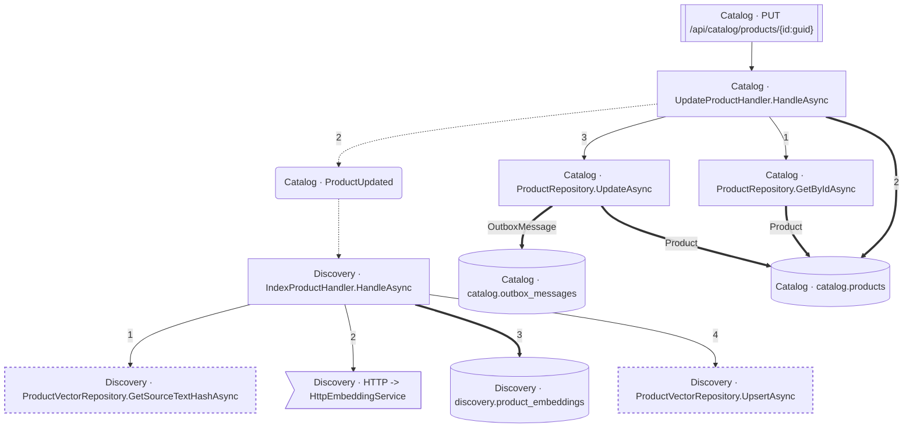

<!-- ÜRETİLMİŞ DOSYA — elle düzenlemeyin. `flowlens docs` ile yeniden üretilir. -->

# PUT /api/catalog/products/{id:guid}

**Modül:** Catalog · **Tanım:** `src/Modules/Catalog/ModularCommerce.Catalog.Api/Endpoints/ProductEndpoints.cs:54`

> **Numaralar kaynak kodda yazılma sırasıdır**, çalışma sırası değil —
> koşullu dallar, döngüler ve erken `return`'ler ikisini ayırır.
> **`koşullu` işaretli adımlar hiç koşmayabilir**, ve bir `if`/ternary'nin iki
> dalındaki adımlar birbirini dışlar — ikisi birden koşmaz.
> Aynı numarayı taşıyan kutular **tek bir çağrıdan** gelir.

## Çağrı sırası

**UpdateProductHandler.HandleAsync** — `src/Modules/Catalog/ModularCommerce.Catalog.Application/Products/UpdateProduct/UpdateProductHandler.cs:11`

1. `UpdateProductHandler.cs:21` → `ProductRepository.GetByIdAsync`
2. `UpdateProductHandler.cs:33` → `ProductUpdated`, `catalog.products`
3. `UpdateProductHandler.cs:40` → `ProductRepository.UpdateAsync`

**ProductRepository.UpdateAsync** — `src/Modules/Catalog/ModularCommerce.Catalog.Infrastructure/Persistence/Repositories/ProductRepository.cs:24`

- `catalog.outbox_messages` — kaynakta bir çağrı ifadesi yok (veri kenarı ya da arayüzden implementasyona geçiş), çağrı yeri kaydedilmedi
- `catalog.products` — kaynakta bir çağrı ifadesi yok (veri kenarı ya da arayüzden implementasyona geçiş), çağrı yeri kaydedilmedi

**IndexProductHandler.HandleAsync** — `src/Modules/Discovery/ModularCommerce.Discovery.Application/Indexing/IndexProductHandler.cs:18`

1. `IndexProductHandler.cs:23` → `ProductVectorRepository.GetSourceTextHashAsync`
2. `IndexProductHandler.cs:30` → `HTTP -> HttpEmbeddingService`
3. `IndexProductHandler.cs:36` → `discovery.product_embeddings`
4. `IndexProductHandler.cs:42` → `ProductVectorRepository.UpsertAsync`

## Veri katmanı

| Tablo | Erişim | Kolonlar | Tanım |
|---|---|---|---|
| `catalog.outbox_messages` | W | — | `src/Modules/Catalog/ModularCommerce.Catalog.Infrastructure/Outbox/OutboxMessageConfiguration.cs:10` |
| `catalog.products` | WR | `Description`, `IsActive`, `Name`, `UpdatedAtUtc`, `price_amount`, `price_currency` | `src/Modules/Catalog/ModularCommerce.Catalog.Infrastructure/Persistence/Configurations/ProductConfiguration.cs:11` |
| `discovery.product_embeddings` | W | `ProductId`, `SourceTextHash`, `UpdatedAtUtc` | `src/Modules/Discovery/ModularCommerce.Discovery.Infrastructure/Persistence/Configurations/ProductEmbeddingConfiguration.cs:11` |

## Diyagram neyi göstermiyor

Gösterilen **12** node; ham yürüyüş **55** node'a ulaşıyor. Gizlenen: 28 ara çağrı, 9 utility, 4 arayüz bildirimi, 2 veriye ulaşmayan dal.

Tam liste: `flowlens trace "PUT /api/catalog/products/{id:guid}"`

## Bilinen sınırlar

- **raw-sql** — Bu akis ham SQL kullaniyor; o erisimin tablosu bu listede YOK. `raw SQL reaches the database outside the model, so no table edge: dataSource.CreateCommand at src/Modules/Discovery/ModularCommerce.Discovery.Infrastructure/Persistence/ProductVectorRepository.cs:26`, `raw SQL reaches the database outside the model, so no table edge: dataSource.CreateCommand at src/Modules/Discovery/ModularCommerce.Discovery.Infrastructure/Persistence/ProductVectorRepository.cs:40`, `raw SQL reaches the database outside the model, so no table edge: dataSource.CreateCommand at src/Modules/Discovery/ModularCommerce.Discovery.Infrastructure/Persistence/ProductVectorRepository.cs:60`
- **second-class-evidence** — Bazi yazma iddialari dolayli kanita dayaniyor: entity insasi ya da parametreli bir SaveChanges. Dogru olabilir, ama dogrudan okunmus degil. `SaveChanges at src/Modules/Catalog/ModularCommerce.Catalog.Infrastructure/Persistence/Repositories/ProductRepository.cs:26 with a tracked Product`, `new ProductEmbedding(...) at src/Modules/Discovery/ModularCommerce.Discovery.Domain/Embeddings/ProductEmbedding.cs:50`
- **ambiguous-implementation** — Bir interface cagrisi birden fazla implementasyona aciliyor. Graph HANGISININ kostugunu KAYDETMIYOR: dekorator zinciri ve koleksiyon enjeksiyonunda hepsi kosar (dogru cevap), config anahtariyla secilende yalniz biri kosar (asiri-yaklasim). Olculen bedel: veri katmaninda 0 tablo/0 kolon, ExternalCall'da 1/1 yanlis pozitif. `src/Modules/Discovery/ModularCommerce.Discovery.Infrastructure/Embedding/FakeEmbeddingService.cs:17`, `src/Modules/Discovery/ModularCommerce.Discovery.Infrastructure/Embedding/HttpEmbeddingService.cs:29`
- **interceptor-columns** — Bir SaveChanges interceptor'inin yazdigi tablolar TABLO duzeyinde dogru, KOLON duzeyinde bos: interceptor'i EF cagirir, kod degil, dolayisiyla govdesindeki atamalar hicbir akisin ulasilabilir kumesinde degil (known-limitations L16-4). `entity:ModularCommerce.Catalog.Infrastructure.Outbox.OutboxMessage`

> Diyagram dar görünüyorsa tıklayarak büyütebilir veya
> [mermaid.live'da açabilirsiniz](https://mermaid.live/edit#pako:eAEBVwSo-3siY29kZSI6ImZsb3djaGFydCBURFxuICBuMFtcIkNhdGFsb2cgwrcgVXBkYXRlUHJvZHVjdEhhbmRsZXIuSGFuZGxlQXN5bmNcIl1cbiAgbjFbXCJDYXRhbG9nIMK3IFByb2R1Y3RSZXBvc2l0b3J5LkdldEJ5SWRBc3luY1wiXVxuICBuMltcIkNhdGFsb2cgwrcgUHJvZHVjdFJlcG9zaXRvcnkuVXBkYXRlQXN5bmNcIl1cbiAgbjNbXCJEaXNjb3ZlcnkgwrcgSW5kZXhQcm9kdWN0SGFuZGxlci5IYW5kbGVBc3luY1wiXVxuICBuNFtcIkRpc2NvdmVyeSDCtyBQcm9kdWN0VmVjdG9yUmVwb3NpdG9yeS5HZXRTb3VyY2VUZXh0SGFzaEFzeW5jXCJdXG4gIG41W1wiRGlzY292ZXJ5IMK3IFByb2R1Y3RWZWN0b3JSZXBvc2l0b3J5LlVwc2VydEFzeW5jXCJdXG4gIG42W1tcIkNhdGFsb2cgwrcgUFVUIC9hcGkvY2F0YWxvZy9wcm9kdWN0cy97aWQ6Z3VpZH1cIl1dXG4gIG43KFwiQ2F0YWxvZyDCtyBQcm9kdWN0VXBkYXRlZFwiKVxuICBuOD5cIkRpc2NvdmVyeSDCtyBIVFRQIC0mZ3Q7IEh0dHBFbWJlZGRpbmdTZXJ2aWNlXCJdXG4gIG45WyhcIkNhdGFsb2cgwrcgY2F0YWxvZy5vdXRib3hfbWVzc2FnZXNcIildXG4gIG4xMFsoXCJDYXRhbG9nIMK3IGNhdGFsb2cucHJvZHVjdHNcIildXG4gIG4xMVsoXCJEaXNjb3ZlcnkgwrcgZGlzY292ZXJ5LnByb2R1Y3RfZW1iZWRkaW5nc1wiKV1cblxuICBuMCAtLT58XCIxXCJ8IG4xXG4gIG4wIC0uLT58XCIyXCJ8IG43XG4gIG4wID09PnxcIjJcInwgbjEwXG4gIG4wIC0tPnxcIjNcInwgbjJcbiAgbjEgPT0-fFwiUHJvZHVjdFwifCBuMTBcbiAgbjIgPT0-fFwiT3V0Ym94TWVzc2FnZVwifCBuOVxuICBuMiA9PT58XCJQcm9kdWN0XCJ8IG4xMFxuICBuMyAtLT58XCIxXCJ8IG40XG4gIG4zIC0tPnxcIjJcInwgbjhcbiAgbjMgPT0-fFwiM1wifCBuMTFcbiAgbjMgLS0-fFwiNFwifCBuNVxuICBuNiAtLT4gbjBcbiAgbjcgLS4tPiBuM1xuXG4gIGNsYXNzRGVmIHVuc2VlbiBzdHJva2UtZGFzaGFycmF5OiA0IDQsc3Ryb2tlLXdpZHRoOjJweFxuICBjbGFzcyBuNCxuNSB1bnNlZW5cbiIsIm1lcm1haWQiOiJ7XG4gIFwidGhlbWVcIjogXCJkZWZhdWx0XCJcbn0iLCJhdXRvU3luYyI6dHJ1ZSwidXBkYXRlRGlhZ3JhbSI6dHJ1ZX1qdHxj).
