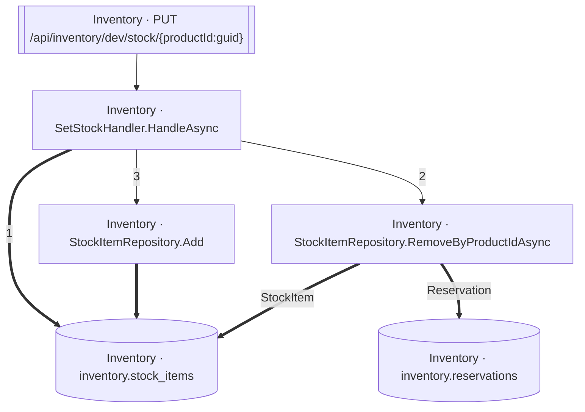

<!-- ÜRETİLMİŞ DOSYA — elle düzenlemeyin. `flowlens docs` ile yeniden üretilir. -->

# PUT /api/inventory/dev/stock/{productId:guid}

**Modül:** Inventory · **Tanım:** `src/Modules/Inventory/ModularCommerce.Inventory.Api/Endpoints/StockEndpoints.cs:32`

> **Numaralar kaynak kodda yazılma sırasıdır**, çalışma sırası değil —
> koşullu dallar, döngüler ve erken `return`'ler ikisini ayırır.
> **`koşullu` işaretli adımlar hiç koşmayabilir**, ve bir `if`/ternary'nin iki
> dalındaki adımlar birbirini dışlar — ikisi birden koşmaz.
> Aynı numarayı taşıyan kutular **tek bir çağrıdan** gelir.

## Çağrı sırası

**SetStockHandler.HandleAsync** — `src/Modules/Inventory/ModularCommerce.Inventory.Application/Stock/SetStock/SetStockHandler.cs:12`

1. `SetStockHandler.cs:16` → `inventory.stock_items`
2. `SetStockHandler.cs:22` → `StockItemRepository.RemoveByProductIdAsync`
3. `SetStockHandler.cs:26` → `StockItemRepository.Add`

**StockItemRepository.RemoveByProductIdAsync** — `src/Modules/Inventory/ModularCommerce.Inventory.Infrastructure/Persistence/Repositories/StockItemRepository.cs:16`

- `inventory.reservations` — kaynakta bir çağrı ifadesi yok (veri kenarı ya da arayüzden implementasyona geçiş), çağrı yeri kaydedilmedi
- `inventory.stock_items` — kaynakta bir çağrı ifadesi yok (veri kenarı ya da arayüzden implementasyona geçiş), çağrı yeri kaydedilmedi

## Veri katmanı

| Tablo | Erişim | Kolonlar | Tanım |
|---|---|---|---|
| `inventory.reservations` | W | — | `src/Modules/Inventory/ModularCommerce.Inventory.Infrastructure/Persistence/Configurations/ReservationConfiguration.cs:11` |
| `inventory.stock_items` | W | `CreatedAtUtc`, `Id`, `OnHand`, `ProductId`, `Reserved`, `UpdatedAtUtc` | `src/Modules/Inventory/ModularCommerce.Inventory.Infrastructure/Persistence/Configurations/StockItemConfiguration.cs:11` |

## Diyagram neyi göstermiyor

Gösterilen **6** node; ham yürüyüş **23** node'a ulaşıyor. Gizlenen: 9 ara çağrı, 4 utility, 3 arayüz bildirimi, 1 veriye ulaşmayan dal.

Tam liste: `flowlens trace "PUT /api/inventory/dev/stock/{productId:guid}"`

## Bilinen sınırlar

- **second-class-evidence** — Bazi yazma iddialari dolayli kanita dayaniyor: entity insasi ya da parametreli bir SaveChanges. Dogru olabilir, ama dogrudan okunmus degil. `new StockItem(...) at src/Modules/Inventory/ModularCommerce.Inventory.Domain/Stock/StockItem.cs:44`

> Diyagram dar görünüyorsa tıklayarak büyütebilir veya
> [mermaid.live'da açabilirsiniz](https://mermaid.live/edit#pako:eAEBSwK0_XsiY29kZSI6ImZsb3djaGFydCBURFxuICBuMFtcIkludmVudG9yeSDCtyBTZXRTdG9ja0hhbmRsZXIuSGFuZGxlQXN5bmNcIl1cbiAgbjFbXCJJbnZlbnRvcnkgwrcgU3RvY2tJdGVtUmVwb3NpdG9yeS5BZGRcIl1cbiAgbjJbXCJJbnZlbnRvcnkgwrcgU3RvY2tJdGVtUmVwb3NpdG9yeS5SZW1vdmVCeVByb2R1Y3RJZEFzeW5jXCJdXG4gIG4zW1tcIkludmVudG9yeSDCtyBQVVQgL2FwaS9pbnZlbnRvcnkvZGV2L3N0b2NrL3twcm9kdWN0SWQ6Z3VpZH1cIl1dXG4gIG40WyhcIkludmVudG9yeSDCtyBpbnZlbnRvcnkucmVzZXJ2YXRpb25zXCIpXVxuICBuNVsoXCJJbnZlbnRvcnkgwrcgaW52ZW50b3J5LnN0b2NrX2l0ZW1zXCIpXVxuXG4gIG4wID09PnxcIjFcInwgbjVcbiAgbjAgLS0-fFwiMlwifCBuMlxuICBuMCAtLT58XCIzXCJ8IG4xXG4gIG4xID09PiBuNVxuICBuMiA9PT58XCJSZXNlcnZhdGlvblwifCBuNFxuICBuMiA9PT58XCJTdG9ja0l0ZW1cInwgbjVcbiAgbjMgLS0-IG4wXG4iLCJtZXJtYWlkIjoie1xuICBcInRoZW1lXCI6IFwiZGVmYXVsdFwiXG59IiwiYXV0b1N5bmMiOnRydWUsInVwZGF0ZURpYWdyYW0iOnRydWV9Cj7Lmw).
