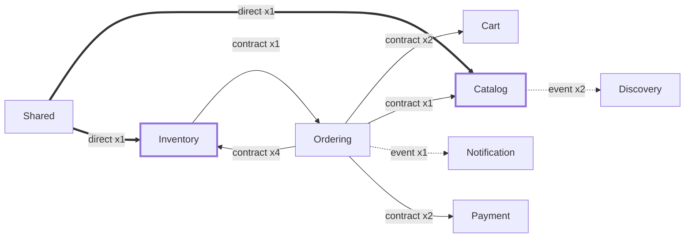

<!-- ÜRETİLMİŞ DOSYA — elle düzenlemeyin. `flowlens docs` ile yeniden üretilir. -->

# Modül bağımlılık grafiği

Bir modülün diğerine bağımlı sayılma kuralı, dokunduğu **katmana** dayanır —
modül adına değil. Katman, node id'sindeki `ModularCommerce.<Modül>.<Katman>`
segmentinden okunur.

| Kategori | Kural | Ok |
|---|---|---|
| **Sözleşme çağrısı** — meşru | hedef katman `Contracts`, kenar `CALLS` | düz `-->` |
| **Event** — meşru, en gevşek bağ | `PUBLISHES` / `CONSUMES` | kesikli `-.->` |
| **Doğrudan referans** — ⚠ ihlal adayı | hedef katman `Application` / `Infrastructure` / `Domain` | kalın `==>` |

## İhlal adayları

`Contracts` dışından doğrudan referanslar. **Bu bir hüküm değil, bir işaret** —
kasıtlı bir tercih olabilir; kararı okuyan verir.

### `Shared` → `Catalog`

- `IDataSeeder.SeedAsync -> CatalogDataSeeder.SeedAsync (src/Modules/Catalog/ModularCommerce.Catalog.Infrastructure/Persistence/Seed/CatalogDataSeeder.cs:14)`

### `Shared` → `Inventory`

- `IDataSeeder.SeedAsync -> InventoryDataSeeder.SeedAsync (src/Modules/Inventory/ModularCommerce.Inventory.Infrastructure/Persistence/Seed/InventoryDataSeeder.cs:18)`

## Shared

`Shared`'a giden **204** kenar diyagrama çizilmedi: 8 modülün tamamı `Shared.Kernel`'e bağlı ve bu tasarım gereği. Hepsini çizmek `Shared`'ı her şeye bağlı bir merkez yapar ve hiçbir şey söylemez.

**Tersi çizilir:** `Shared` bir modülün içine çağrı yapıyorsa bağımlılık ters yöndedir
ve ihlal adayı olarak işaretlenir.
